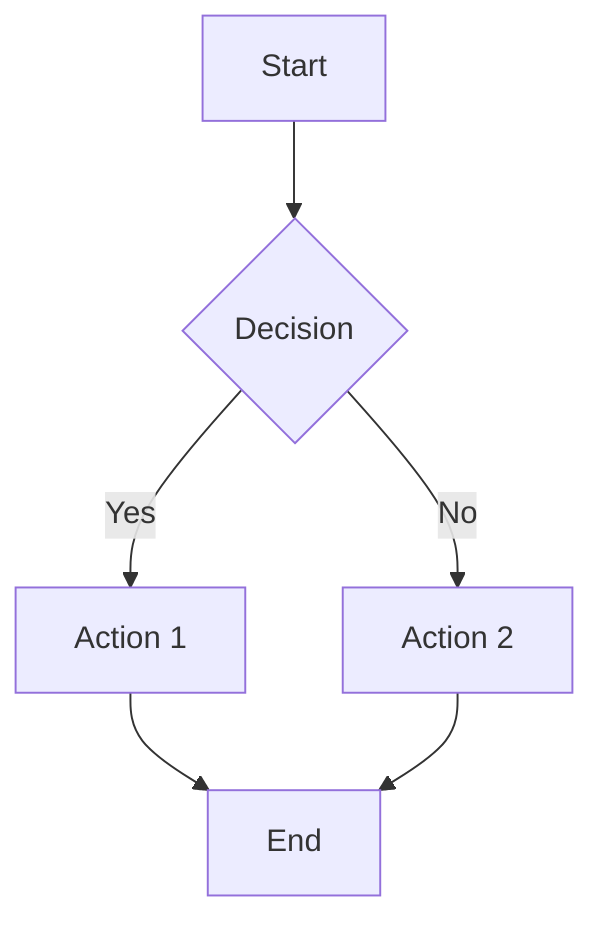
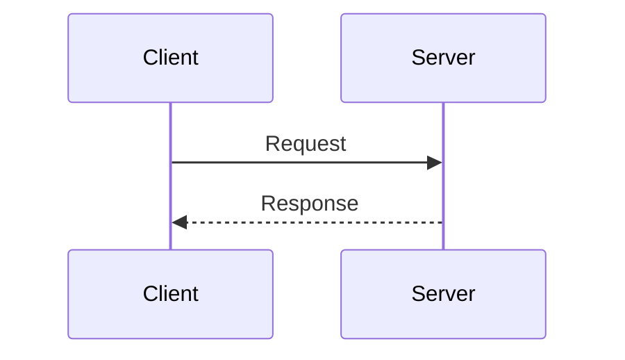

# Mermaid to PNG Converter

Converts Mermaid diagram files (.mmd) or code blocks to PNG images using the mermaid-cli tool.

## Prerequisites

**Required tools:**
- Node.js and npm
- mermaid-cli (`@mermaid-js/mermaid-cli`)
- Google Chrome or Chromium browser

**Installation:**
```bash
# Install mermaid-cli globally
npm install -g @mermaid-js/mermaid-cli

# Or use npx (no installation needed)
npx -y @mermaid-js/mermaid-cli@latest --version
```

## Quick Start

### Convert a Single File

```bash
mmdc -i input.mmd -o output.png -b white -s 2
```

**Parameters:**
- `-i`: Input mmd file
- `-o`: Output png file
- `-b`: Background color (`white`, `transparent`, or hex color)
- `-s`: Scale factor (default 1, use 2 for 2x resolution)

### Batch Convert All Diagrams

Use the provided Python script to extract and convert all mermaid blocks from a file:

```bash
python3 ~/.cursor/skills/mermaid-to-png/scripts/convert.py path/to/diagrams.mmd
```

**Output:** PNG files saved to `flowchart_png/` directory

## Supported Input Formats

1. **Standalone .mmd files**
   ```mermaid
   flowchart TD
       A --> B --> C
   ```

2. **Markdown files with mermaid blocks**
   ```markdown
   # Document
   ```mermaid
   sequenceDiagram
       A->>B: Message
   ```
   ```

3. **Direct mermaid code**
   Pass mermaid syntax directly to the conversion function

## Usage Patterns

### Pattern 1: Single File Conversion

```bash
# Basic conversion
mmdc -i diagram.mmd -o diagram.png

# High-resolution with white background
mmdc -i diagram.mmd -o diagram.png -b white -s 2

# Transparent background
mmdc -i diagram.mmd -o diagram.png -b transparent
```

### Pattern 2: Batch Conversion from Markdown

For markdown files containing multiple mermaid blocks:

```bash
python3 ~/.cursor/skills/mermaid-to-png/scripts/convert.py input.md
```

This extracts all ````mermaid` code blocks and generates numbered PNG files.

### Pattern 3: Programmatic Conversion

```python
import subprocess

def mermaid_to_png(input_file, output_file, background='white', scale=2):
    """Convert mermaid file to PNG"""
    cmd = [
        'mmdc',
        '-i', input_file,
        '-o', output_file,
        '-b', background,
        '-s', str(scale)
    ]
    subprocess.run(cmd, check=True)
```

## Troubleshooting

### Error: Chrome not found

Set the Chrome executable path:

```bash
# macOS
export PUPPETEER_EXECUTABLE_PATH="/Applications/Google Chrome.app/Contents/MacOS/Google Chrome"

# Linux
export PUPPETEER_EXECUTABLE_PATH="/usr/bin/google-chrome"

# Windows
export PUPPETEER_EXECUTABLE_PATH="C:\Program Files\Google\Chrome\Application\chrome.exe"
```

### Error: mmdc not found

Use npx instead:
```bash
npx -y @mermaid-js/mermaid-cli@latest -i input.mmd -o output.png
```

### Permission Errors

If running in a restricted environment, install Chromium locally:
```bash
npx playwright install chromium
```

## Examples

### Example 1: Simple Flowchart

Input (`flow.mmd`):


Command:
```bash
mmdc -i flow.mmd -o flow.png -b white -s 2
```

### Example 2: Sequence Diagram

Input (`seq.mmd`):


Command:
```bash
mmdc -i seq.mmd -o seq.png -b transparent
```

### Example 3: Multiple Diagrams from Single File

For a markdown file with multiple mermaid blocks, use the batch script:

```bash
python3 ~/.cursor/skills/mermaid-to-png/scripts/convert.py document.md
```

Output:
- `flowchart_png/diagram_1.png`
- `flowchart_png/diagram_2.png`
- `flowchart_png/diagram_3.png`
...

## Advanced Options

### Custom Width

```bash
mmdc -i input.mmd -o output.png -w 1920
```

### Custom CSS Theme

```bash
mmdc -i input.mmd -o output.png -C custom.css
```

### Config File

Create `mermaid-config.json`:
```json
{
  "theme": "default",
  "themeVariables": {
    "primaryColor": "#e1f5fe"
  }
}
```

Then use:
```bash
mmdc -i input.mmd -o output.png -c mermaid-config.json
```

## References

- [Mermaid CLI Documentation](https://github.com/mermaid-js/mermaid-cli)
- [Mermaid Syntax Guide](https://mermaid.js.org/intro/)
- [Playwright Documentation](https://playwright.dev/)
