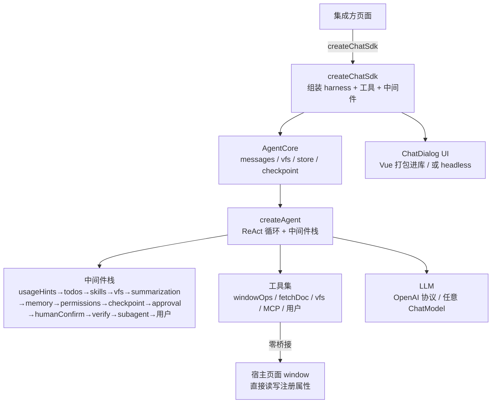

# chat-sdk

> 框架无关的**页面内 Agent JS SDK** —— 一行代码把一个会调工具的 AI 助手对话框挂到任意网页，让 AI 直接读写宿主页面的 `window` 属性、抓取文档，实现「AI 改页面」。

[](https://www.npmjs.com/package/chat-sdk)
[](./LICENSE)
[](#自测)

---

## 这是什么

`chat-sdk` 是一个**框架无关**的 JS SDK：以对话框形态挂载到任意网页，内置一个基于 **ReAct 模式**的 Tool-Calling Agent。Agent 通过自定义 tool 直接读写宿主页面 `window` 对象上的属性（基于**属性注册表 + schema 校验**）、GET 抓取文档，并具备 **planning / skills / 虚拟工作区 / 快照回退 / 人工确认 / 会话级 checkpoint / context 管理**能力。

- **Vue 打包进库**（非 peer），使用者无需安装 Vue；同时支持 `ui:false` headless 模式，集成方用响应式 `messages` + `send`/`stream` 自建 UI（框架无关更彻底）
- **provider 抽离**：`llm` 可传任意 LangChain `BaseChatModel` 实例，或 `LLMConfig` 配置对象（内部构造 `ChatOpenAI`，兼容 OpenAI 协议，默认接 DeepSeek）
- **自研 Deep Agents 风格 harness**：不引入 LangGraph / langchain 整包，规避浏览器打包阻塞，中间件可插拔

## 特性

- 🛠 **window 操作工具集**：属性注册表 + zod schema 校验 + 增量 patch 编辑（`edit_window_prop` 按 jsonPath 只发改动）+ 快照回退 + JSONPath 查询 + 模糊搜索 + 沙箱脚本
- 🧠 **ReAct Agent harness**：可插拔中间件（before/after/wrap 三类钩子，正序/逆序/洋葱执行），8 个扩展点
- 📋 **planning / skills / memory**：`write_todos` 任务规划、`define_skill` 渐进式披露、AGENTS.md 风格持久指令
- 🗄 **虚拟工作区 vfs**：内存文件系统（read/write/edit/ls/glob/grep），大结果外存转 vfs 只留预览
- ↩️ **回退体系**：windowOps per-path 快照栈（精细修小错）+ 会话级 checkpoint（整体回大错，一键回到上次正常时）
- ✋ **人工确认**：被动白名单（写操作前弹框）+ 主动征询（`request_human_confirmation`，AI 不确定/多方案/高风险时主动问你）
- ✅ **verify 自检**：agent 返回前跑 check 自纠（默认 `createWriteBackCheck` 写后读回 + schema 校验），可选对抗式验证
- 🤖 **子 agent 编排**：`spawn_agent`/`spawn_agents` 委派独立子任务（过程不占主上下文），支持预声明命名角色
- 🔌 **MCP 接入**：连远程 MCP server 动态注入工具（http/sse/websocket）
- 📦 **上下文管理**：4 层自适应压缩（offload 外存 / 逐轮截断 / 输入摘要 / 内存上限），预设档位 + LLM 摘要 + 关键词召回
- 💾 **持久化**：IndexedDB（降级内存）+ 三层命名空间隔离 + 全局配额/LRU 淘汰 + 多会话切换
- 🎨 **可定制 UI**：CSS 变量换主题，去 AI 风格化渐变

## 快速开始

### 安装

```bash
npm install chat-sdk
# 同时装 peer 依赖
npm install zod @langchain/openai @langchain/core
```

### 最小示例

```ts
import { createChatSdk } from 'chat-sdk'
import { z } from 'zod'

const sdk = createChatSdk({
  container: '#chat',
  llm: { apiKey: 'sk-...', baseUrl: 'https://api.deepseek.com', model: 'deepseek-chat' },
  systemPrompt: '你是页面操作助手。通过工具读写宿主页面的 window 属性。',
  windowProps: [
    { path: 'app.theme', description: '主题', schema: z.enum(['light', 'dark']) },
    { path: 'app.count', description: '计数', schema: z.number().int() },
  ],
}).mount()
```

用户对对话框说「把主题改成 dark」→ AI 调 `set_window_prop({ path: 'app.theme', value: 'dark' })` → 经 schema 校验写入 → 页面响应式更新。

### CDN（零配置）

```html
<script src="https://unpkg.com/chat-sdk"></script>
<script>
  ChatSdk.createChatSdk({
    container: '#chat',
    llm: { apiKey: 'sk-...', baseUrl: 'https://api.deepseek.com', model: 'deepseek-chat' },
    windowProps: [{ path: 'app.theme', description: '主题', schema: { type: 'string', enum: ['light','dark'] } }],
  }).mount()
</script>
```

ESM（esm.sh，peer 自动解析）：

```ts
import { createChatSdk, z } from 'https://esm.sh/chat-sdk'
```

## 它能做什么

| 能力 | 说明 | 选项 |
|---|---|---|
| **window 操作** | 读写宿主页面 `window` 注册属性，schema 校验 + 增量编辑 + 快照回退 | `windowProps` / `capabilities.windowOps` |
| **文档抓取** | `fetch_document` GET 抓取网页/文档（带注入防御） | `capabilities.fetch` |
| **任务规划** | `write_todos` 整表替换任务清单，逐步推进 | `capabilities.planning` |
| **技能披露** | `define_skill`/`load_skill` 渐进式披露长指令 | `capabilities.skills` |
| **虚拟工作区** | vfs 文件系统，大结果外存 | `capabilities.vfs` |
| **上下文压缩** | 4 层自适应压缩，预设档位 | `contextPreset` / `contextOptions` |
| **持久指令** | AGENTS.md 风格 memory 注入 system prompt | `memory` / `capabilities.memory` |
| **人工确认** | 写操作前确认 + AI 主动征询 | `approval` |
| **会话回退** | 每轮 checkpoint，一键回到上次正常时 | `checkpoint` |
| **自检自纠** | 返回前 check，不通过 feedback 回灌重试 | `capabilities.verify` |
| **子 agent** | 委派独立子任务，过程不占主上下文 | `subagent` / `subagents` |
| **MCP** | 连远程 MCP server 动态注入工具 | `mcp` |
| **持久化** | IndexedDB 多会话 + 配额淘汰 + 切换 | `storage` |

所有能力默认开（`verify`/`approval`/`checkpoint` 默认关），可经 `capabilities` 关掉无用能力省 token/体积。

## 架构



- **harness**（`core/harness/`）：`createAgent` ReAct 循环 + 中间件执行器 + 各内置中间件
- **sdk**（`core/sdk/`）：`createChatSdk` 命令式入口 + `defineTool`
- **tools**（`core/tools/`）：`windowOps`（属性注册表+增量编辑+快照）/ `fetchDoc`
- **backends**：`vfs`（内存工作区）/ `storage`（IndexedDB 持久化）
- **composables**：`useChat` / `useContextManager` / `useMarkdown`
- **components**：`ChatDialog` / `MessageContent` / `CodePreview` / `DebugDrawer`

## 配置

### 环境变量（`.env`，前缀 `VITE_`）

```bash
VITE_AI_API_KEY=sk-...
VITE_AI_BASE_URL=https://api.deepseek.com
VITE_AI_MODEL=deepseek-chat
VITE_AI_TEMPERATURE=0.3        # JSON/结构化操作建议低温
# VITE_AI_MAX_TOKENS=16384      # 不配则按模型自动取值(deepseek-v4→384K)
VITE_AI_SYSTEM_PROMPT=你是通用页面操作助手。   # 必须单行
```

### 核心 options

```ts
createChatSdk({
  container: '#root',
  llm: { apiKey, baseUrl, model },
  id: 'my-agent',              // 稳定 id(多 agent 隔离 + 持久化恢复);不传随机生成
  systemPrompt: '...',
  windowProps: [{ path, description, schema }],
  tools: [], skills: [], memory: '',
  storage: 'indexed',          // 持久化('indexed'/'session'/'local'/'memory';默认关)
  streaming: true,             // 流式逐字(默认 true)
  ui: 'default',               // 'default' | false(headless)
  capabilities: { verify: true, windowOps: true, ... },  // 能力开关
  approval: { tools: ['set_window_prop','edit_window_prop'] },  // 人工确认
  checkpoint: true,            // 会话级回滚
  contextPreset: 'auto',       // 上下文压缩档位 auto/conservative/aggressive
  summaryLlm: { ... },         // 摘要专用 LLM(不配用主 llm)
  maxRetries: 2,               // 模型调用重试(网络/429/5xx)
  maxParallelTools: 1,         // 同轮工具并发
  subagent: { allowedTools: [...] },
  middleware: [/* 自定义中间件 */],
}).mount()
```

## 示例

仓库 `examples/` 提供多个可运行 demo（`npm run dev` 后访问对应 html）：

| 示例 | 入口 | 演示 |
|---|---|---|
| page-demo | `/` | 自举开发 demo：左 JSON 响应式页面 + 右对话框 |
| nested-demo | `/nested.html` | 嵌套区块树编辑（`window.Editor.PageInfo`）+ 人工确认 + checkpoint 回退 |
| subagent-demo | `/subagent.html` | 子 agent 并行编排 |
| mcp-demo | `/mcp.html` | MCP 远程工具接入（需 `npm run mcp:mock`） |
| toolsets-demo | `/toolsets.html` | 内置工具集手动注入 |

框架无关集成示例：`demo/plain.html`（importmap + esm.sh）。

## 自测

```bash
npm test   # tsx 跑 src/core/__tests__/selftest.ts,341 项断言,不依赖 LLM
```

覆盖核心逻辑：windowOps / vfs / 中间件执行器 / 存储配额淘汰 / retry / pool / subagent / mcp extractText / verify / toolsets / usageHints / 模型能力自适应 / 结构化报错 / ReAct 健壮性 / 安全（原型污染防御）/ 上下文压缩预设 / approval / humanConfirm / checkpoint / trimMemoryMessages 旧摘要合并。

## 文档

| 文档 | 内容 |
|---|---|
| [使用手册](./doc/usage-guide.md) | 安装 / 快速开始 / 配置项 / 能力详解 / 自定义中间件 / FAQ |
| [功能架构](./doc/architecture.md) | 分层结构 / 运行控制流 / window 操作安全流（mermaid 图） |
| [上下文组成与压缩策略](./doc/context-management.md) | 上下文 3 部分组成 / 4 层压缩策略 / 流程图 |
| [文件全览](./doc/architecture-files.md) | 逐文件职责 / 模块依赖 / 数据流 |
| [项目指引 CLAUDE.md](./CLAUDE.md) | 架构要点 / 约定与坑 / 编码规范 |
| [规范真相源](./openspec/specs/page-agent-core.md) | 需求规范 |

## 与 Deep Agents 的关系

`chat-sdk` 借鉴 [Deep Agents](https://github.com/langchain-ai/deepagents) 的 harness 思路（ReAct + 中间件 + planning + skills + memory + context 管理），但**自研实现**：

- 不引入 LangGraph / langchain 整包（规避浏览器打包阻塞）
- 面向**浏览器端 / 宿主页面内**场景（持久化用 IndexedDB，而非服务端 DB）
- 上下文：输入压缩 + 内存裁剪（旧摘要合并防逐级丢失）+ 大结果 offload 到 vfs，而非 LangGraph checkpointer 每步存档
- 未实现 Deep Agents 的跨会话语义 store 与持久化时间旅行（checkpoint 仅内存）

详见 [上下文组成与压缩策略 - 与 Deep Agents 的差异](./doc/context-management.md#七与-deep-agents-的差异)。

## 开发

```bash
npm install
npm run dev      # 开发(端口 3000,被占则 3001)
npm run build    # 库模式构建到 dist/(ESM + UMD + IIFE + CSS)
npm run preview  # 预览构建产物
npm test         # 自测
```

构建产物：
- `dist/chat-sdk.js`（ESM，peer 外置）
- `dist/chat-sdk.umd.cjs`（UMD）
- `dist/chat-sdk.iife.js`（IIFE 全量，CDN 单文件直引，~1.6MB）
- `dist/chat-sdk.css`
- `types/index.d.ts`（手动维护）

## 贡献

欢迎 Issue / PR。提 PR 前请确保 `npm run build` + `npm test` 通过，`types/index.d.ts` 与 `src/core/index.ts` 导出一致。详见 [CLAUDE.md](./CLAUDE.md) 的编码规范。

## License

[ISC](./LICENSE)
