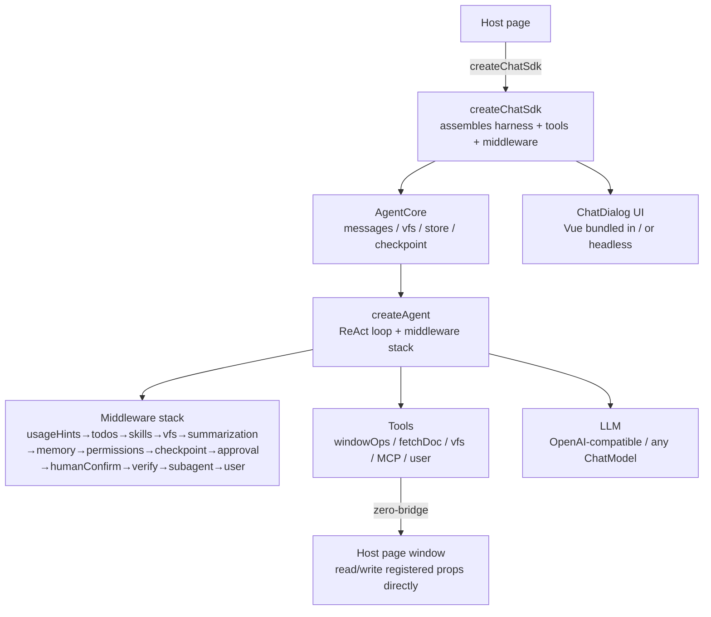

# page-agent-sdk

> **[English](./README.md)** · **[中文](./README.zh-CN.md)**

> Give your web page an **AI assistant that edits the page itself**. Mount a chat dialog in one line; the AI reads/writes page data safely via schema-validated tools — "conversational" building/editing/ops.

> **AI agent integration**: see [Agent Integration Cheat Sheet](#agent-integration-cheat-sheet-for-ai-agents) below (exports / options / extension points / built-in tools / file structure). Architecture & gotchas in [`CLAUDE.md`](./CLAUDE.md).

[](https://www.npmjs.com/package/page-agent-sdk)
[](./LICENSE)
[](#self-tests)

---

## Who is it for

**Low-code / visual builders, form & page designers, CMS, ops consoles** — anywhere "page data is structured, and you want natural language to drive it".

One-line gist: **declare the page data structure (schema) to the Agent; it reads/writes via tools, validated by schema** — "editing the page" goes from drag/fill to a single sentence.

## Use cases

| Scenario | User says | AI does |
|---|---|---|
| 🏗 **Low-code builder** | "Top banner → dark, bold the title, add a new-product card" | Incremental patch the component tree via jsonPath; canvas refreshes live |
| 📝 **Form designer** | "Add phone format validation, address → 3-level cascade" | Incremental field-definition edits, schema-validated |
| 📰 **CMS ops** | "Prefix these products with 'Limited', mark under ¥100 red" | JSONPath filter + sandbox script batch edit |
| 🖥 **Ops console** | "Raise A's threshold to 30%, turn off switch B" | Whitelist + human-confirm to edit config, read-back verify |
| 🤖 **AI-native assistant** | "Change this chart's legend to bars" | Conversational ops on product data, no UI needed |

> `examples/nested-demo` is a full low-code example: nested block tree + human confirm + one-click rollback.

## 30-second quickstart

```bash
npm install page-agent-sdk zod @langchain/openai @langchain/core
```

```ts
import { createChatSdk } from 'page-agent-sdk'
import { z } from 'zod'

window.page = { title: 'New Products', theme: 'light' }

createChatSdk({
  container: '#chat',
  llm: { apiKey: 'sk-...', baseUrl: 'https://api.deepseek.com', model: 'deepseek-chat' },
  systemPrompt: 'You are a page-builder assistant; read/write window.page via tools.',
  windowProps: [
    { path: 'page.title', description: 'Page title', schema: z.string() },
    { path: 'page.theme', description: 'Theme', schema: z.enum(['light', 'dark']) },
  ],
  approval: { tools: ['set_window_prop', 'edit_window_prop'] }, // confirm writes
  checkpoint: true, // one-click rollback on mistake
}).mount()
```

User says "title → 'Summer New', theme → dark" → AI calls `edit_window_prop` (incremental) → schema validation → pre-write confirm → reactive refresh. Said wrong? Click "↩ Undo".

CDN zero-config: `<script src="https://unpkg.com/page-agent-sdk"></script>` → `ChatSdk.createChatSdk({...})`.

## Capabilities

| Capability | Description | Option |
|---|---|---|
| 🛠 window ops | Read/write registered props, schema validation + incremental patch + snapshot rollback | `windowProps` |
| 🧠 ReAct harness | Pluggable middleware (8 hooks), in-house (no LangGraph) | `middleware` |
| 📋 planning/skills/memory | `write_todos` / `define_skill` / AGENTS.md directives | `capabilities.*` |
| 🗄 virtual workspace | In-memory file system; large results offloaded (won't blow context) | `capabilities.vfs` |
| ↩️ rollback | per-path snapshots (small fixes) + session checkpoint (big fixes) | `checkpoint` |
| ✋ human confirm | Pre-write dialog + AI proactive inquiry (uncertain/multi-plan/high-risk) | `approval` |
| ✅ self-verify | Run `check` before return; on fail, feedback re-injects to self-correct | `capabilities.verify` |
| 🤖 subagents | Delegate subtasks; process stays out of main context | `subagent` |
| 🔌 MCP | Connect remote MCP servers, inject tools dynamically | `mcp` |
| 📦 context compression | 4-layer adaptive compression, presets + LLM summary | `contextPreset` |
| 💾 persistence | IndexedDB multi-session + quota eviction + switch | `storage` |

Capabilities default on (`verify`/`approval`/`checkpoint` default off; **proactive `humanConfirm` default on** — AI asks when uncertain/multi-plan instead of guessing). Turn off unneeded ones via `capabilities` to save tokens.

## Agent Integration Cheat Sheet (for AI agents)

> Dense integration reference for AI agents: exports / options / extension points / built-in tools / file structure. Deep dive in `doc/` and `CLAUDE.md`.

### Exports (`import { ... } from 'page-agent-sdk'`)

```ts
// entry & tool construction
createChatSdk, defineTool, defineSkill, presets, z
// harness & middleware (custom orchestration)
createAgent, createSubagentMiddleware, createSubagentsMiddleware,
createVerifyMiddleware, createWriteBackCheck, createApprovalMiddleware,
createHumanConfirmMiddleware, createHumanConfirmTool, createCheckpointMiddleware, createCheckpointManager,
createUsageHintsMiddleware, createWindowOps, createVfs, connectMcp
// context & model
resolveContextOptions, CONTEXT_PRESETS, resolveModelCaps, estimateTokens
// storage
createSessionStore, createMemoryBackend, createWebStorageBackend, isQuotaError
// UI (reuse when headless)
ChatDialog, MessageContent, CodePreview, useChat
// types (omitted): ChatSdkOptions, Middleware, SubagentConfig, SkillSpec, WindowPropSpec, AgentMessage, StreamEvent …
```

### `createChatSdk` options cheat sheet

| Group | Option | Type / Default | Description |
|---|---|---|---|
| **Basics** | `container` | `string \| HTMLElement` | Mount point (`ui:true` required) |
| | `ui` | `boolean \| 'default'` · default `true` | `false` = headless (build UI with `agent.messages`) |
| | `llm` | `LLMConfig \| BaseChatModel` · **required** | `LLMConfig={apiKey,baseUrl?,model?,temperature?,maxTokens?}`; OpenAI-compatible (default DeepSeek) |
| | `id` | `string` | Stable id (multi-agent isolation + persistence resume; random+warn if omitted) |
| | `systemPrompt` | `string` | Agent identity (no hardcoded business; inject via this) |
| **Page data** | `windowProps` | `{path,description,schema}[]` | Register window props readable/writable by tools + zod schema |
| | `tools` / `skills` / `memory` | `Tool[]` / `SkillSpec[]` / `string` | Custom tools / skills / AGENTS.md-style directives |
| **Capability toggles** | `capabilities` | `{planning?,windowOps?,fetch?,skills?,vfs?,summarization?,memory?,subagent?,verify?}` | Default all on (`verify` default off); `false` to turn off |
| | `permissions` | `PermissionRule[]` | Scope whitelist (first-match-wins, default off) |
| | `humanConfirm` | `boolean` · default `true` | Proactive inquiry (AI asks when uncertain/multi-plan) |
| | `approval` | `{tools?,confirm?,timeoutMs?,humanConfirmTool?}` · default off | Passive confirm whitelist (pre-write allow/deny) |
| | `checkpoint` | `boolean \| {maxCheckpoints?,auto?}` · default off | Session-level rollback (`auto` default `true`) |
| | `verify` | `{check?,maxAttempts?,adversarial?}` | Needs `capabilities.verify:true`; `check` omitted → `createWriteBackCheck` |
| **Subagents** | `subagent` | `{allowedTools?,systemPrompt?,temperature?,llm?,maxDepth?·1,maxParallel?·4}` | Runtime ad-hoc delegation (`spawn_agent`/`spawn_agents`) |
| | `subagents` | `SubagentConfig[]` | Pre-declared named subagents → each generates `use_<id>` tool |
| **Context** | `contextPreset` | `'auto' \| 'conservative' \| 'aggressive'` · default `auto` | Compression preset |
| | `contextOptions` | `Partial<ContextManagerOptions> \| false` | Fine params (`false` disables compression) |
| | `summaryLlm` | `BaseChatModel \| LLMConfig` | Summary-dedicated LLM (defaults to main `llm`) |
| | `maxMemoryRounds` | `number` · default `50` | Dialog history memory round cap (`0` disables trim) |
| | `vfs` | `{initialFiles?,maxBytes?}` · default 4MB | In-memory workspace cap (LRU evict on overflow) |
| **Persistence** | `storage` | `'indexed' \| 'session' \| 'local' \| 'memory' \| config \| false` · default off | Assign to enable; multi-agent isolated by `id` |
| | `session` | `{id?,autoResume?,title?}` | Session control |
| | `shareContext` | `boolean` · default `false` | Same `id` instances share one agent |
| **Robustness/other** | `maxRetries` / `maxParallelTools` / `maxToolRounds` | `number` · 2 / 1 / 10 | Model retries / per-round tool concurrency / max rounds |
| | `mcp` | `McpServerConfig[]` | Remote MCP servers (http/sse/websocket) |
| | `middleware` | `Middleware[]` | Custom middleware (appended to built-in stack) |
| | `streaming` / `title` / `placeholder` / `debug` | — | UI/debug |

### Extension points

```ts
// ① Custom tool
const myTool = defineTool({ name: 'do_x', description: '...', schema: z.object({...}), handler: (args) => 'result' })
createChatSdk({ tools: [myTool], /*...*/ })

// ② Custom skill (progressive disclosure: load_skill fetches details on demand)
const mySkill = defineSkill({ name: 'style_guide', description: 'Brand color spec', body: 'Primary #1f4d3a…' })
createChatSdk({ skills: [mySkill], /*...*/ })

// ③ Custom middleware (8 hooks: beforeAgent/wrapModelCall/beforeModel/afterModel/wrapToolCall/afterAgent/beforeReturn + augmentPrompt/compressInput/tools)
const mw: Middleware = { name: 'telemetry', afterModel: async (ctx, next) => { await next(ctx); console.log('round done') } }
createChatSdk({ middleware: [mw], /*...*/ })

// ④ Pre-declared subagents (planner-reflector-executor fixed roles)
createChatSdk({ subagents: [
  { id: 'planner', description: 'Creative planner', temperature: 0.9, systemPrompt: '…' },
  { id: 'reflector', description: 'Reflective reviewer', temperature: 0.3, systemPrompt: '…' },
], /*...*/ })
```

### Built-in tools (Agent-callable)

- **window ops** (after `windowProps` registered): `list_window_props` / `describe_window_prop` / `get_window_prop` / `get_window_paths` / `set_window_prop` / `edit_window_prop` (jsonPath incremental patch) / `delete_window_prop` / `snapshot_window_prop` / `list_window_snapshots` / `restore_window_snapshot`
- **window query**: `query_window_prop` (JSONPath) / `search_window_prop` (fuzzy) / `eval_window_script` (sandboxed)
- **fetch**: `fetch_document`
- **vfs**: `vfs_read` / `vfs_write` / `vfs_edit` / `vfs_ls` / `vfs_glob` / `vfs_grep`
- **planning/skills**: `write_todos` / `define_skill` / `load_skill`
- **human confirm**: `request_human_confirmation` (proactive inquiry, default on)
- **subagents**: `spawn_agent` / `spawn_agents` / `use_<id>` (pre-declared)
- **checkpoint**: `restore_last_checkpoint` / `list_checkpoints`

### File structure

```
src/core/
├── sdk/createChatSdk.ts        # imperative entry (assembles harness + tools + middleware)
│   sdk/defineTool.ts  presets.ts  contextPreset.ts
├── harness/                    # in-house ReAct harness (middleware-driven)
│   createAgent.ts  middleware.ts  state.ts
│   todos.ts  skills.ts  memory.ts  summarization.ts  retry.ts
│   subagent.ts  verify.ts  approval.ts  humanConfirm.ts  checkpoint.ts
│   permissions.ts  usageHints.ts
├── tools/                      # windowOps (registry + incremental edit + snapshot) / windowQuery / fetchDoc
├── backends/                   # vfs (memory) / storage (IndexedDB + multi-backend + quota eviction)
├── mcp/client.ts              # remote MCP tool integration
├── composables/               # useChat / useContextManager / useMarkdown
├── components/                 # ChatDialog / MessageContent / CodePreview / DebugDrawer
└── types/index.ts  index.ts    # types / sole library entry
examples/                       # page-demo / nested-demo / human-confirm-demo / planner-demo / subagent-demo / mcp-demo
doc/                            # usage-guide / architecture / context-management / architecture-files
CLAUDE.md                       # architecture + gotchas + coding conventions (agent must-read)
```

### Extension points

```ts
// ① Custom tool
const myTool = defineTool({ name: 'do_x', description: '...', schema: z.object({...}), handler: (args) => 'result' })
createChatSdk({ tools: [myTool], /*...*/ })

// ② Custom skill (progressive disclosure: load_skill fetches details on demand)
const mySkill = defineSkill({ name: 'style_guide', description: 'Brand color spec', body: 'Primary #1f4d3a…' })
createChatSdk({ skills: [mySkill], /*...*/ })

// ③ Custom middleware (8 hooks: beforeAgent/wrapModelCall/beforeModel/afterModel/wrapToolCall/afterAgent/beforeReturn + augmentPrompt/compressInput/tools)
const mw: Middleware = { name: 'telemetry', afterModel: async (ctx, next) => { await next(ctx); console.log('round done') } }
createChatSdk({ middleware: [mw], /*...*/ })

// ④ Pre-declared subagents (planner-reflector-executor fixed roles)
createChatSdk({ subagents: [
  { id: 'planner', description: 'Creative planner', temperature: 0.9, systemPrompt: '…' },
  { id: 'reflector', description: 'Reflective reviewer', temperature: 0.3, systemPrompt: '…' },
], /*...*/ })
```

### Built-in tools (Agent-callable)

- **window ops** (after `windowProps` registered): `list_window_props` / `describe_window_prop` / `get_window_prop` / `get_window_paths` / `set_window_prop` / `edit_window_prop` (jsonPath incremental patch) / `delete_window_prop` / `snapshot_window_prop` / `list_window_snapshots` / `restore_window_snapshot`
- **window query**: `query_window_prop` (JSONPath) / `search_window_prop` (fuzzy) / `eval_window_script` (sandboxed)
- **fetch**: `fetch_document`
- **vfs**: `vfs_read` / `vfs_write` / `vfs_edit` / `vfs_ls` / `vfs_glob` / `vfs_grep`
- **planning/skills**: `write_todos` / `define_skill` / `load_skill`
- **human confirm**: `request_human_confirmation` (proactive inquiry, default on)
- **subagents**: `spawn_agent` / `spawn_agents` / `use_<id>` (pre-declared)
- **checkpoint**: `restore_last_checkpoint` / `list_checkpoints`

### File structure

```
src/core/
├── sdk/createChatSdk.ts        # imperative entry (assembles harness + tools + middleware)
│   sdk/defineTool.ts  presets.ts  contextPreset.ts
├── harness/                    # in-house ReAct harness (middleware-driven)
│   createAgent.ts  middleware.ts  state.ts
│   todos.ts  skills.ts  memory.ts  summarization.ts  retry.ts
│   subagent.ts  verify.ts  approval.ts  humanConfirm.ts  checkpoint.ts
│   permissions.ts  usageHints.ts
├── tools/                      # windowOps (registry + incremental edit + snapshot) / windowQuery / fetchDoc
├── backends/                   # vfs (memory) / storage (IndexedDB + multi-backend + quota eviction)
├── mcp/client.ts              # remote MCP tool integration
├── composables/               # useChat / useContextManager / useMarkdown
├── components/                 # ChatDialog / MessageContent / CodePreview / DebugDrawer
└── types/index.ts  index.ts    # types / sole library entry
examples/                       # page-demo / nested-demo / human-confirm-demo / planner-demo / subagent-demo / mcp-demo
doc/                            # usage-guide / architecture / context-management / architecture-files
CLAUDE.md                       # architecture + gotchas + coding conventions (agent must-read)
```

## Architecture



- **Framework-agnostic**: Vue bundled in the lib (not a peer); host can be React/vanilla. Also supports `ui:false` headless
- **Provider-agnostic**: `llm` accepts any LangChain `BaseChatModel`, or `LLMConfig` (builds `ChatOpenAI` internally, OpenAI-compatible, default DeepSeek)
- **In-house harness**: no LangGraph/langchain full bundle; avoids browser bundling blockers

## Configuration

```bash
# .env (VITE_ prefix)
VITE_AI_API_KEY=sk-...
VITE_AI_BASE_URL=https://api.deepseek.com
VITE_AI_MODEL=deepseek-chat
VITE_AI_TEMPERATURE=0.3        # low temp recommended for structured ops
# VITE_AI_MAX_TOKENS=           # omit → model default
```

```ts
createChatSdk({
  container: '#root',
  llm: { apiKey, baseUrl, model },
  id: 'my-agent',              // stable id (multi-agent isolation + persistence resume)
  systemPrompt: '...',
  windowProps: [{ path, description, schema }],
  storage: 'indexed',          // persistence (default off)
  streaming: true, ui: 'default',
  capabilities: { verify: true },        // capability toggles
  humanConfirm: true,           // proactive inquiry (default on)
  approval: { tools: ['set_window_prop','edit_window_prop'] }, // passive confirm whitelist (default off)
  checkpoint: true,
  contextPreset: 'auto',       // auto/conservative/aggressive
  summaryLlm: { ... },         // summary-dedicated LLM (defaults to main llm)
  maxRetries: 2, maxParallelTools: 1,
  subagent: { allowedTools: [...] },
  middleware: [/* custom middleware */],
  onEvent(e) {                 // SDK event callback: subscribe to common moments (window prop change / message update / tool call / error), replaces polling
    if (e.type === 'window_prop_change') refreshUI()
  },
}).mount()
```

## Examples

After `npm run dev`, visit the corresponding page:

| Example | Entry | Demonstrates |
|---|---|---|
| page-demo | `/` | Self-bootstrapping demo: left JSON reactive page + right chat |
| nested-demo | `/nested.html` | Nested block tree + human confirm + checkpoint |
| human-confirm-demo | `/human-confirm.html` | AI proactive inquiry (multi-plan pick) + pre-write confirm |
| planner-demo | `/planner.html` | Plan-reflect-execute (high-temp creative planner + low-temp reflector) |
| subagent-demo | `/subagent.html` | Subagent parallel orchestration |
| mcp-demo | `/mcp.html` | MCP remote tools (needs `npm run mcp:mock`) |

Framework-agnostic integration: `demo/plain.html` (importmap + esm.sh).

## Documentation

| Doc | Contents |
|---|---|
| [Doc Index](./doc/README.en.md) | Navigation + other info sources (specs/changes/tests) |
| [Usage Guide](./doc/usage-guide.en.md) | Install / options / capability deep-dive / custom middleware / FAQ |
| [Architecture](./doc/architecture.md) *(Chinese)* | Layering / control flow / window-op safety flow |
| [Context & Compression](./doc/context-management.md) *(Chinese)* | Context composition / 4-layer compression / flow diagrams |
| [File Overview](./doc/architecture-files.md) *(Chinese)* | Per-file responsibilities / deps / data flow |
| [CLAUDE.md](./CLAUDE.md) | **agent must-read** · architecture / gotchas / coding conventions |

## Self-tests

```bash
npm test   # 341 assertions, no LLM dependency
```

## Local npm package test

Verify the **published npm package** actually works (distinct from `src/` local code and `dist/*.iife.js` local build): set up a standalone vite app in an isolated directory, install `page-agent-sdk` from the npm registry, and run it.

**Scenario**: after publishing a new version, confirm the package from `npm install page-agent-sdk` imports + mounts + calls tools correctly; or reproduce an integrator's issue in a clean environment (ruling out local `node_modules` cache / stale `dist` artifacts).

**Minimal steps**:

```bash
mkdir npm-pkg-test && cd npm-pkg-test
npm init -y
npm install page-agent-sdk zod @langchain/openai @langchain/core
npm install -D vite typescript
```

`index.html` (mount point) + `main.ts`:

```ts
import { createChatSdk, z } from 'page-agent-sdk'
import 'page-agent-sdk/style.css'

window.app = { title: 'Demo', theme: 'light' }

createChatSdk({
  container: '#root',
  llm: { apiKey: 'sk-...', baseUrl: 'https://api.deepseek.com/v1', model: 'deepseek-chat' },
  systemPrompt: 'You are a page assistant; read/write window.app via tools.',
  windowProps: [
    { path: 'app.title', description: 'Title', schema: z.string() },
    { path: 'app.theme', description: 'Theme', schema: z.enum(['light', 'dark']) },
  ],
}).mount()
```

`npx vite` → type "change app.theme to dark" in the dialog → AI calls `set_window_prop` → `window.app.theme` becomes `dark` → verified.

> Add this test dir to `.gitignore` (local only, not in repo) to avoid committing `.env` with real keys to remotes.

## Development

```bash
npm install
npm run dev      # port 3000 (3001 if occupied)
npm run build    # ESM + UMD + IIFE + CSS
npm test
```

## Relationship to Deep Agents

Borrows the harness idea from [Deep Agents](https://github.com/langchain-ai/deepagents) (ReAct + middleware + planning + skills + memory + context management), but implemented in-house: no LangGraph/langchain full bundle; browser-oriented (persistence via IndexedDB, not server-side DB); context via input compression + memory trim + large-result offload, rather than per-step checkpointer archival. See [Context & Compression - Differences from Deep Agents](./doc/context-management.md#七与-deep-agents-的差异).

## License

[ISC](./LICENSE)
