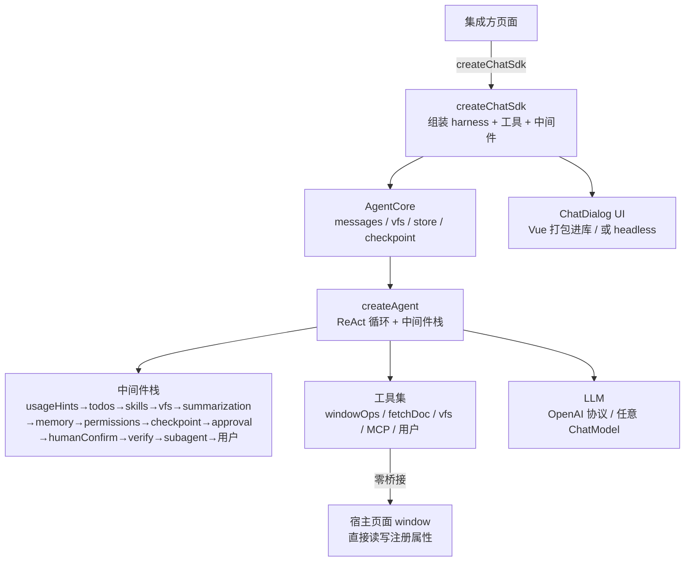

# page-agent-sdk

> **[English](./README.md)** · **[中文](./README.zh-CN.md)**

> 给网页一个**会改页面的 AI 助手**。一行代码挂载对话框，AI 通过工具按 schema 安全读写页面数据，实现「对话式」搭建/编辑/运维。

> **AI agent 接入**：直接看下方「[Agent 接入速查](#agent-接入速查给-ai-agent-读)」（导出 / 选项表 / 扩展点 / 内置工具 / 文件结构），架构与约定坑见 [`CLAUDE.md`](./CLAUDE.md)。

[](https://www.npmjs.com/package/page-agent-sdk)
[](./LICENSE)
[](#自测)

---

## 适合谁

**低代码 / 可视化搭建平台、表单与页面设计器、CMS、智能运维台**——凡是「页面有可结构化描述的数据，希望用自然语言驱动它变化」的场景。

核心思路一句话：**把页面数据结构（schema）声明给 Agent，它用工具按 schema 安全读写**——「改页面」从拖拽/手填变成一句话。

### 它是什么：规范化的 JSON 操作 Agent

本质是给 AI 一个**规范化、安全的 JSON 操作通道**。AI 改 JSON 不再是「生成一段文本塞回去」这种不可控方式，而是经四道规范约束的结构化操作：

| 约束 | 机制 | 作用 |
|---|---|---|
| **范围控制** | 属性注册表（`windowProps`）—— 只能动声明的 path | AI 越界改未注册字段 → 拒绝 |
| **合法性校验** | zod schema —— `set`/`edit` 按 schema 校验 | 类型/枚举/结构不合法 → 结构化错误,不写入 |
| **增量操作** | `edit_window_prop` 按 `jsonPath` 发 patch(set/remove/merge/append) | 避免重传整个大 JSON,精确改局部 |
| **可回滚** | per-path 快照(自动入栈)+ 会话 checkpoint | 改坏了一键回退到上次正常态 |

「改 JSON」从 LLM 自由生成文本 → **结构化、可校验、可审计、可回滚**的工具操作。这是它区别于「让 AI 直接输出 JSON 字符串」的根本所在。

## 使用场景

| 场景 | 用户说 | AI 做 |
|---|---|---|
| 🏗 **低代码搭建** | 「顶部 Banner 改深色、主标题加粗、加一张新品卡」 | 按 jsonPath 增量 patch 组件树，画布实时刷新 |
| 📝 **表单设计器** | 「手机号加格式校验、地址改三级联动」 | 增量改字段定义，schema 校验防错 |
| 📰 **CMS 运营** | 「这批商品标题加『限时』前缀、低于 100 元的标红」 | JSONPath 筛选 + 沙箱脚本批量改 |
| 🖥 **运维配置台** | 「A 实验阈值调到 30%、关掉 B 开关」 | 白名单 + 人工确认改配置，写后读回校验 |
| 🤖 **AI 原生助手** | 「把这张看板的图例改成柱状」 | 对话操作产品自有数据，免做 UI |
| 🔬 **调研 agent** | 「对比 3 个方案，推荐哪个」 | 并行子 agent 各调研一个，只回结论 |
| 🧩 **Headless / 服务端** | 「在 Node.js 里跑 agent」 | `ui:false` + `storage:'memory'`，用 `sdk.send` 驱动 |

> 仓库 `examples/nested-demo` 即低代码场景完整示例：嵌套区块树 + 人工确认 + 一键回退。

**完整端到端场景（含可复制代码，共 9 例：低代码搭建 / 表单设计器 / CMS 批量 / 运维配置台 / AI 原生 / 调研 / 服务端 / 多 agent / MCP）** 见随包附带的 Agent Skill：`skills/page-agent-sdk-integrate/references/use-cases.md`（npm 包内同样包含）。安装 skill 见下文[给 AI 工具使用者的 Skills](#给-ai-工具使用者的-skills集成方安装)。

## 30 秒上手

```bash
npm install page-agent-sdk zod @langchain/openai @langchain/core
```

```ts
import { createChatSdk } from 'page-agent-sdk'
import { z } from 'zod'

window.page = { title: '新品专区', theme: 'light' }

createChatSdk({
  container: '#chat',
  llm: { apiKey: 'sk-...', baseUrl: 'https://api.deepseek.com', model: 'deepseek-chat' },
  systemPrompt: '你是页面搭建助手，通过工具读写 window.page。',
  windowProps: [
    { path: 'page.title', description: '页面标题', schema: z.string() },
    { path: 'page.theme', description: '主题', schema: z.enum(['light', 'dark']) },
  ],
  approval: { tools: ['set_window_prop', 'edit_window_prop'] }, // 写操作弹确认
  checkpoint: true, // 误改一键回退
}).mount()
```

用户说「标题改成『夏日新品』、主题切深色」→ AI 调 `edit_window_prop` 增量改 → schema 校验 → 写前确认 → 响应式刷新。说错了?点「↩ 回退」。

CDN 零配置：`<script src="https://unpkg.com/page-agent-sdk"></script>` → `ChatSdk.createChatSdk({...})`。

## 它能做什么

| 能力 | 说明 | 选项 |
|---|---|---|
| 🛠 window 操作 | 读写注册属性，schema 校验 + 增量 patch + 快照回退 | `windowProps` |
| 🧠 ReAct harness | 可插拔中间件（8 钩子），自研不引 LangGraph | `middleware` |
| 📋 规划/技能/记忆 | `write_todos` / `define_skill` / AGENTS.md 指令 | `capabilities.*` |
| 🗄 虚拟工作区 | 内存文件系统，大结果外存不撑爆上下文 | `capabilities.vfs` |
| ↩️ 回退 | per-path 快照（修小错）+ 会话 checkpoint（回大错） | `checkpoint` |
| ✋ 人工确认 | 写前弹框 + AI 主动征询（不确定/多方案/高风险） | `approval` |
| ✅ 自检自纠 | 返回前 check，不通过 feedback 回灌重试 | `capabilities.verify` |
| 🤖 子 agent | 委派子任务，过程不占主上下文 | `subagent` |
| 🔌 MCP | 连远程 MCP server 动态注入工具 | `mcp` |
| 📦 上下文压缩 | 4 层自适应压缩，预设档位 + LLM 摘要 | `contextPreset` |
| 🛡️ 压缩不丢信息 | 摘要内嵌当前 windowProps 快照 + 保留指定工具结果；写返回附可操作 path；`systemPromptHelpers.reliableWriteRules` | 内置 |
| 💾 持久化 | IndexedDB 多会话 + 配额淘汰 + 切换 | `storage` |

能力默认开（`verify`/`approval`/`checkpoint` 默认关；**主动征询 `humanConfirm` 默认开**——AI 遇不确定/多方案主动问你、不猜测），可经 `capabilities` 关掉无用的省 token。

## Agent 接入速查（给 AI agent 读）

> 本节是给 AI agent 的密集接入参考：导出清单 / 选项表 / 扩展点 / 内置工具 / 文件结构。深挖见 `doc/` 与 `CLAUDE.md`。

### 导出（`import { ... } from 'page-agent-sdk'`）

```ts
// 入口与工具构造
createChatSdk, defineTool, defineSkill, presets, z
// harness 与中间件(自定义编排)
createAgent, createSubagentMiddleware, createSubagentsMiddleware,
createVerifyMiddleware, createWriteBackCheck, createApprovalMiddleware,
createHumanConfirmMiddleware, createHumanConfirmTool, createCheckpointMiddleware, createCheckpointManager,
createUsageHintsMiddleware, createWindowOps, createVfs, connectMcp
// 上下文/模型
resolveContextOptions, CONTEXT_PRESETS, resolveModelCaps, estimateTokens
// 存储
createSessionStore, createMemoryBackend, createWebStorageBackend, isQuotaError
// UI(headless 自建 UI 复用)
ChatDialog, MessageContent, CodePreview, useChat
// 类型(略):ChatSdkOptions, Middleware, SubagentConfig, SkillSpec, WindowPropSpec, AgentMessage, StreamEvent …
```

### `createChatSdk` 选项速查

| 分类 | 选项 | 类型 / 默认 | 说明 |
|---|---|---|---|
| **基础** | `container` | `string \| HTMLElement` | 挂载点（`ui:true` 必传） |
| | `ui` | `boolean \| 'default'` · 默认 `true` | `false` = headless（用 `agent.messages` 自建 UI） |
| | `llm` | `LLMConfig \| BaseChatModel` · **必传** | `LLMConfig={apiKey,baseUrl?,model?,temperature?,maxTokens?}`；兼容 OpenAI 协议（默认 DeepSeek） |
| | `id` | `string` | 稳定 id（多 agent 隔离 + 持久化恢复；不传随机+warn） |
| | `systemPrompt` | `string` | Agent 身份（不硬编码业务，靠这注入）。可选——不传用内置默认（页面操作助手 + `reliableWriteRules`）；传了则完全覆盖 |
| **页面数据** | `windowProps` | `{path,description,schema}[]` | 注册可被工具读写的 window 属性 + zod schema 校验 |
| | `tools` / `skills` / `memory` | `Tool[]` / `SkillSpec[]` / `string` | 自定义工具 / 技能 / AGENTS.md 风格持久指令 |
| **能力开关** | `capabilities` | `{planning?,windowOps?,fetch?,skills?,vfs?,summarization?,memory?,subagent?,verify?}` | 默认全开（`verify` 默认关）；`false` 关掉省 token |
| | `permissions` | `PermissionRule[]` | scope 白名单（first-match-wins，默认不启用） |
| | `humanConfirm` | `boolean` · 默认 `true` | 主动征询（AI 不确定/多方案主动问你，不猜测） |
| | `approval` | `{tools?,confirm?,timeoutMs?,humanConfirmTool?}` · 默认关 | 被动确认白名单（写操作前弹允许/拒绝） |
| | `checkpoint` | `boolean \| {maxCheckpoints?,auto?}` · 默认关 | 会话级回滚（`auto` 默认 `true` 每轮存档） |
| | `verify` | `{check?,maxAttempts?,adversarial?}` | 需 `capabilities.verify:true`；`check` 省略用 `createWriteBackCheck` |
| **子 agent** | `subagent` | `{allowedTools?,systemPrompt?,temperature?,llm?,maxDepth?·1,maxParallel?·4}` | 运行时自由委派（`spawn_agent`/`spawn_agents`） |
| | `subagents` | `SubagentConfig[]` | 预声明命名子 agent → 每个生成 `use_<id>` 委派工具 |
| **上下文** | `contextPreset` | `'auto' \| 'conservative' \| 'aggressive'` · 默认 `auto` | 压缩预设档位 |
| | `contextOptions` | `Partial<ContextManagerOptions> \| false` | 细参覆盖（`false` 关压缩）。含 `preserveLastToolResults`（默认 `['describe_window_prop','list_window_props']`——压缩摘要里保留字段说明） |
| | `summaryLlm` | `BaseChatModel \| LLMConfig` | 摘要专用 LLM（不配用主 `llm`） |
| | `maxMemoryRounds` | `number` · 默认 `50` | 对话历史内存上限轮次（`0` 关裁剪） |
| | `vfs` | `{initialFiles?,maxBytes?}` · 默认 4MB | 内存工作区上限（超限 LRU 淘汰） |
| **持久化** | `storage` | `'indexed' \| 'session' \| 'local' \| 'memory' \| 配置 \| false` · 默认关 | 赋值开启；多 agent 靠 `id` 隔离 |
| | `session` | `{id?,autoResume?,title?}` | 会话控制 |
| | `shareContext` | `boolean` · 默认 `false` | 同 `id` 多实例共享同一 agent |
| **鲁棒/其他** | `maxRetries` / `maxParallelTools` / `maxToolRounds` | `number` · 2 / 1 / 10 | 模型重试 / 同轮工具并发 / 最大轮次 |
| | `mcp` | `McpServerConfig[]` | 远程 MCP server（http/sse/websocket） |
| | `middleware` | `Middleware[]` | 自定义中间件（拼到内置栈末尾） |
| | `streaming` / `title` / `placeholder` / `debug` | — | UI/调试 |

### 扩展点

```ts
// ① 自定义工具
const myTool = defineTool({ name: 'do_x', description: '...', schema: z.object({...}), handler: (args) => 'result' })
createChatSdk({ tools: [myTool], /*...*/ })

// ② 自定义技能(渐进披露:用到才 load_skill 加载详情)
const mySkill = defineSkill({ name: 'style_guide', description: '品牌色规范', body: '主色 #1f4d3a…' })
createChatSdk({ skills: [mySkill], /*...*/ })

// ③ 自定义中间件(8 钩子:beforeAgent/wrapModelCall/beforeModel/afterModel/wrapToolCall/afterAgent/beforeReturn + augmentPrompt/compressInput/tools)
const mw: Middleware = { name: 'telemetry', afterModel: async (ctx, next) => { await next(ctx); console.log('round done') } }
createChatSdk({ middleware: [mw], /*...*/ })

// ④ 预声明子 agent(规划-反思-执行等固定角色)
createChatSdk({ subagents: [
  { id: 'planner', description: '创意规划', temperature: 0.9, systemPrompt: '…' },
  { id: 'reflector', description: '反思审查', temperature: 0.3, systemPrompt: '…' },
], /*...*/ })
```

### 内置工具（Agent 可调用）

- **window 操作**（`windowProps` 注册后）：`list_window_props` / `describe_window_prop` / `get_window_prop` / `get_window_paths` / `set_window_prop` / `edit_window_prop`（jsonPath 增量 patch）/ `delete_window_prop` / `snapshot_window_prop` / `list_window_snapshots` / `restore_window_snapshot`
- **window 查询**：`query_window_prop`（JSONPath）/ `search_window_prop`（模糊搜索）/ `eval_window_script`（沙箱脚本）
- **抓取**：`fetch_document`
- **vfs**：`vfs_read` / `vfs_write` / `vfs_edit` / `vfs_ls` / `vfs_glob` / `vfs_grep`
- **规划/技能**：`write_todos` / `define_skill` / `load_skill`
- **人工确认**：`request_human_confirmation`（主动征询，默认开）
- **子 agent**：`spawn_agent` / `spawn_agents` / `use_<id>`（预声明）
- **checkpoint**：`restore_last_checkpoint` / `list_checkpoints`

### 文件结构

```
src/core/
├── sdk/createChatSdk.ts        # 命令式入口(组装 harness+工具+中间件)
│   sdk/defineTool.ts  presets.ts  contextPreset.ts
├── harness/                    # 自研 ReAct harness(中间件驱动)
│   createAgent.ts  middleware.ts  state.ts
│   todos.ts  skills.ts  memory.ts  summarization.ts  retry.ts
│   subagent.ts  verify.ts  approval.ts  humanConfirm.ts  checkpoint.ts
│   permissions.ts  usageHints.ts
├── tools/                      # windowOps(注册表+增量编辑+快照)/ windowQuery / fetchDoc
├── backends/                   # vfs(内存) / storage(IndexedDB+多后端+配额淘汰)
├── mcp/client.ts              # MCP 远程工具接入
├── composables/               # useChat / useContextManager / useMarkdown
├── components/                 # ChatDialog / MessageContent / CodePreview / DebugDrawer
└── types/index.ts  index.ts    # 类型 / 库唯一入口
examples/                       # page-demo / nested-demo / dynamic-demo / human-confirm-demo / planner-demo / subagent-demo / mcp-demo / toolsets-demo
doc/                            # usage-guide / architecture / context-management / architecture-files
CLAUDE.md                       # 架构要点 + 约定坑 + 编码规范（agent 必读）
```

## 给 AI 工具使用者的 Skills（集成方安装）

内置一个开箱即用的 Agent Skill，供使用 Claude Code / Cursor（或任何加载 `.claude/skills/` / `~/.claude/skills/` 的 agent 工具）的集成方使用。它教 AI 如何在**你的项目**中使用本 SDK：

| Skill | 触发场景 |
|---|---|
| `page-agent-sdk-integrate` | 集成 SDK —— 选引入方式、声明 `windowProps` + zod schema、配 LLM、挂载、订阅事件（`onEvent` / `sdk.hook`）、跑 headless、排查常见坑 |

**安装**（任选其一）：

```bash
# 方式 A —— 从已安装的 npm 包复制
npm i page-agent-sdk
cp -R node_modules/page-agent-sdk/skills/page-agent-sdk-integrate ~/.claude/skills/

# 方式 B —— 从仓库下载（无需安装）
curl -L https://github.com/whyymj/chat-sdk/tarball/master | tar xz --strip-components=1 --wildcards '*/skills/page-agent-sdk-integrate'
mv skills/page-agent-sdk-integrate ~/.claude/skills/
```

安装后重启 AI 工具；当你说「把 page-agent-sdk 加到我的页面」等时 skill 自动触发。

> 另有 `page-agent-sdk-release`（维护者发布工作流）skill 仅保留在仓库 `.claude/skills/` 供项目维护者自用，**不**通过 npm 包公开分发。

## 架构



- **框架无关**：Vue 打包进库（非 peer），宿主用 React/原生都行；也支持 `ui:false` headless 自建 UI —— 且可在 **Node.js 服务端**跑作后端 Agent（自定义工具/子 agent/自检；关 `windowOps`+`fetch`，用 `storage:'memory'`）
- **provider 抽离**：`llm` 传任意 LangChain `BaseChatModel`，或 `LLMConfig`（内部构造 `ChatOpenAI`，兼容 OpenAI 协议，默认接 DeepSeek）
- **自研 harness**：不引 LangGraph/langchain 整包，规避浏览器打包阻塞

## 配置

```bash
# .env（前缀 VITE_）
VITE_AI_API_KEY=sk-...
VITE_AI_BASE_URL=https://api.deepseek.com
VITE_AI_MODEL=deepseek-chat
VITE_AI_TEMPERATURE=0.3        # 结构化操作建议低温
# VITE_AI_MAX_TOKENS=           # 不配则按模型自动取值
```

```ts
createChatSdk({
  container: '#root',
  llm: { apiKey, baseUrl, model },
  id: 'my-agent',              // 稳定 id（多 agent 隔离 + 持久化恢复）
  systemPrompt: '...',
  windowProps: [{ path, description, schema }],
  storage: 'indexed',          // 持久化（默认关）
  streaming: true, ui: 'default',
  capabilities: { verify: true },        // 能力开关
  humanConfirm: true,           // 主动征询（默认开；AI 不确定/多方案主动问你）
  approval: { tools: ['set_window_prop','edit_window_prop'] }, // 被动确认白名单（默认关）
  checkpoint: true,
  contextPreset: 'auto',       // auto/conservative/aggressive
  summaryLlm: { ... },         // 摘要专用 LLM（不配用主 llm）
  maxRetries: 2, maxParallelTools: 1,
  subagent: { allowedTools: [...] },
  middleware: [/* 自定义中间件 */],
  onEvent(e) {                 // SDK 事件回调:订阅常用时机(window 属性变化/消息更新/工具调用/错误),替代轮询
    if (e.type === 'window_prop_change') refreshUI()
  },
}).mount()
```

## 示例

`npm run dev` 后访问对应页面：

| 示例 | 入口 | 演示 |
|---|---|---|
| page-demo | `/` | 自举 demo：左 JSON 响应式页面 + 右对话框 |
| nested-demo | `/examples/nested-demo/` | 嵌套区块树 + 人工确认 + checkpoint |
| dynamic-demo | `/examples/dynamic-demo/` | 懒加载组件 + 动态注册 schema（`sdk.addWindowProp`/`removeWindowProp`） |
| human-confirm-demo | `/examples/human-confirm-demo/` | AI 主动征询（多方案点选）+ 写前确认 |
| planner-demo | `/examples/planner-demo/` | 规划-反思-执行（高温创意 planner + 低温 reflector） |
| subagent-demo | `/examples/subagent-demo/` | 子 agent 并行编排 |
| mcp-demo | `/examples/mcp-demo/` | MCP 远程工具（需 `npm run mcp:mock`） |

框架无关集成：`demo/plain.html`（importmap + esm.sh）。

## 文档

| 文档 | 内容 |
|---|---|
| [文档索引](./doc/README.md) | 各文档导航 + 其他信息源（规范/变更/自测） |
| [使用手册](./doc/usage-guide.md) | 安装 / 配置项 / 能力详解 / 自定义中间件 / FAQ |
| [功能架构](./doc/architecture.md) | 分层 / 控制流 / window 操作安全流 |
| [上下文与压缩](./doc/context-management.md) | 上下文组成 / 4 层压缩 / 流程图 |
| [文件全览](./doc/architecture-files.md) | 逐文件职责 / 依赖 / 数据流 |
| [CLAUDE.md](./CLAUDE.md) | **agent 必读** · 架构要点 / 约定坑 / 编码规范 |

## 自测

```bash
npm test            # 364 项断言（tsx 源码级，不依赖 LLM）
npm run test:e2e    # 120 项集成断言（node 跑构建产物 dist；覆盖各 API/配置项/功能模块/简单与复杂场景：默认 systemPrompt(含能力概述) / 动态注册与 inspect 同步 / inspect(tools/middleware/subagent/verify/mcp/todos/lastCompression/checkpoints 反映配置) / 自定义 tools/middleware/skills/memory 注入 / switchSession(开/未开) / shareContext 开/关共享独立 / storage 后端+对象配置 / presets 三预设 / checkpoint / 导出项完整(39+ 函数/组件) / 工具函数可用(isQuotaError/estimateTokens/jpEval/searchJson) / source=builtin / mount 边界 / hook 多监听器 / llm 配置 / 错误场景）
```

## 本地 npm 包测试

验证 **npm 发布包**实际可用（区别于 `src/` 本地代码与 `dist/*.iife.js` 本地产物）：在独立目录建一个 vite 应用，从 npm registry 装 `page-agent-sdk` 跑起来。

**场景**：发布新版后确认 `npm install page-agent-sdk` 装到的包能正常 import + mount + 调工具；或在干净环境复现集成方遇到的问题（排除本机 `node_modules` 缓存/`dist` 旧产物的干扰）。

**最小步骤**：

```bash
mkdir npm-pkg-test && cd npm-pkg-test
npm init -y
npm install page-agent-sdk zod @langchain/openai @langchain/core
npm install -D vite typescript
```

`index.html`（挂载点）+ `main.ts`：

```ts
import { createChatSdk, z } from 'page-agent-sdk'
import 'page-agent-sdk/style.css'

window.app = { title: '示例', theme: 'light' }

createChatSdk({
  container: '#root',
  llm: { apiKey: 'sk-...', baseUrl: 'https://api.deepseek.com/v1', model: 'deepseek-chat' },
  systemPrompt: '你是页面助手，用工具读写 window.app。',
  windowProps: [
    { path: 'app.title', description: '标题', schema: z.string() },
    { path: 'app.theme', description: '主题', schema: z.enum(['light', 'dark']) },
  ],
}).mount()
```

`npx vite` → 对话框输入「把 app.theme 改成 dark」→ AI 调 `set_window_prop` → `window.app.theme` 变为 `dark` 即验证通过。

> 建议此测试目录加入 `.gitignore`（纯本地，不进仓库），避免把含真实 key 的 `.env` 提交到远程。

## 体积与按需引入

包提供三种构建产物,按集成场景选择:

| 产物 | 文件 | 适用场景 | 大小 |
|---|---|---|---|
| ESM(peer 外置) | `dist/page-agent-sdk.js` | npm 或 esm.sh `import`,模块化宿主推荐 | ~620 KB |
| UMD | `dist/page-agent-sdk.umd.cjs` | Node/老 bundler `require` | ~560 KB |
| IIFE(全量单文件) | `dist/page-agent-sdk.iife.js` | CDN `<script>` 直引,零配置 | ~1.4 MB |

`sideEffects` 仅标记 `["**/*.css"]`,打包器可对 JS 做 tree-shaking。瘦身建议:

- **headless(`ui:false`)**:不渲染内置对话框,自渲染 `agent.messages` —— 可不引 `ChatDialog`/`CodePreview`,并省略 CSS(`import 'page-agent-sdk'` 不引 `'page-agent-sdk/style.css'`)。
- **关闭无用能力**:`capabilities:{ windowOps:false, fetch:false, planning:false, skills:false, vfs:false, summarization:false, memory:false, subagent:false }` —— 移除对应工具 schema 与中间件(省 token,非字节)。
- **CDN 用 esm.sh**:`import { createChatSdk } from 'https://esm.sh/page-agent-sdk'` —— peer(`zod`、`@langchain/*`)由 esm.sh 自动解析去重,模块场景最小。
- **IIFE 仅用于零配置**:全量单文件方便但最重,宿主支持模块时优先 ESM。
- **MCP 为可选 peer**:`@modelcontextprotocol/sdk` 仅在传 `options.mcp` 时动态 import —— 不用 MCP 完全不加载该运行时。

## 开发

```bash
npm install
npm run dev      # 端口 3000（被占则 3001）
npm run build    # ESM + UMD + IIFE + CSS
npm test
```

## 与 Deep Agents 的关系

借鉴 [Deep Agents](https://github.com/langchain-ai/deepagents) 的 harness 思路（ReAct + 中间件 + planning + skills + memory + context 管理），但自研实现：不引 LangGraph/langchain 整包；面向浏览器端（持久化用 IndexedDB 而非服务端 DB）；上下文用输入压缩 + 内存裁剪 + 大结果 offload，而非每步 checkpointer 存档。详见 [上下文与压缩 - 与 Deep Agents 的差异](./doc/context-management.md#七与-deep-agents-的差异)。

## License

[ISC](./LICENSE)
