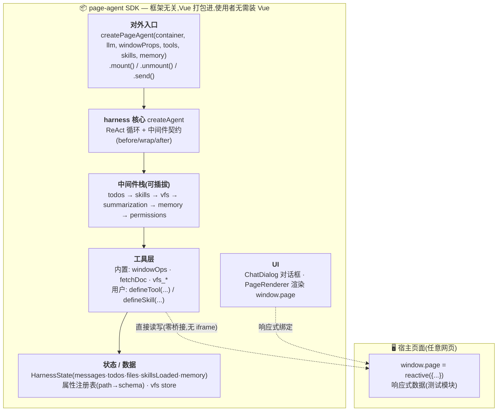
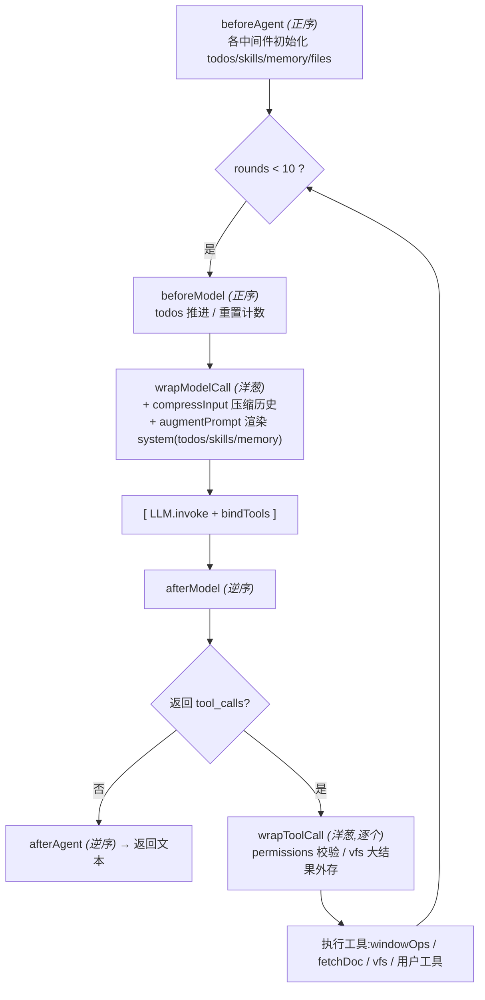
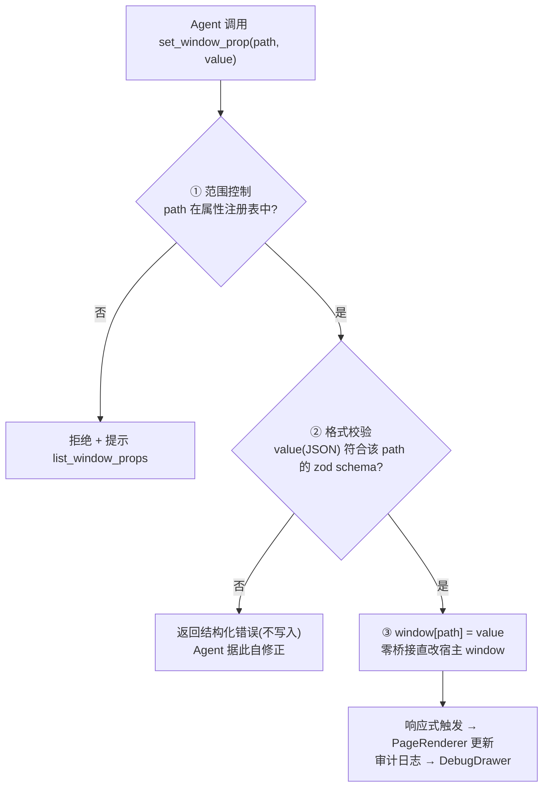

# page-agent 功能架构

> 框架无关的「页面内 Agent」JS SDK。Agent 通过自定义 tool 读写宿主页面 `window` 对象(属性注册表 + schema 校验),并具备 planning / skills / 内存工作区 / context 管理能力。
> 核心为**自研 Deep Agents 风格 harness**(ReAct + 可插拔中间件),不引入 LangGraph/langchain 整包(规避 [`deepagentsjs#292`](https://github.com/langchain-ai/deepagentsjs/issues/292) 浏览器打包阻塞)。

本文从三个视角描述:**分层结构**、**运行控制流**、**window 操作安全流**。

---

## ① 分层结构

### 分层职责

| 层 | 职责 | 关键源文件 |
|---|---|---|
| **对外入口** | 命令式 API,组装 harness + 内置工具/中间件,挂载 UI | `src/core/sdk/createPageAgent.ts`、`src/core/sdk/defineTool.ts` |
| **harness 核心** | ReAct 循环 + 中间件生命周期驱动 | `src/core/harness/createAgent.ts`、`middleware.ts`、`state.ts` |
| **中间件栈** | 可插拔能力(planning/skills/工作区/压缩/记忆/权限) | `src/core/harness/{todos,skills,summarization,memory,permissions}.ts` |
| **工具层** | Agent 可调用的能力(window 操作/抓文档/工作区/自定义) | `src/core/tools/{windowOps,fetchDoc}.ts`、`src/core/backends/vfs.ts`、`src/core/utils/offload.ts` |
| **状态/数据** | 运行态 + 注册表 + 工作区存储 | `HarnessState`、属性注册表(`createWindowOps`)、`VfsStore` |
| **UI(通用)** | 对话框 + 调试抽屉(SDK 内) | `src/core/components/{ChatDialog,DebugDrawer}.vue` |
| **定制 demo** | 左侧 JSON 响应式页面(开发自举,非 SDK 部分) | `examples/page-demo/{App,PageRenderer}.vue` |

---

## ② 运行控制流(ReAct + 中间件生命周期)

> 钩子顺序与 Deep Agents 一致:**before 类正序、after 类逆序、wrap 类洋葱(reduceRight)**。
> 工具结果以 `ToolMessage` 追加到上下文,循环直到 LLM 不再调工具或达上限(`MAX_TOOL_ROUNDS = 10`)。

---

## ③ window 操作安全流(核心)

**window 工具集**(均限属性注册表):`list_window_props` · `describe_window_prop` · `get_window_prop`(读自身/后代子路径/祖先) · `get_window_paths`(批量按路径读局部) · `set_window_prop`(范围 + schema 校验,整体替换) · `edit_window_prop`(按 jsonPath 增量改:set/remove/merge/append) · `delete_window_prop` · `snapshot_window_prop`/`list_window_snapshots`/`restore_window_snapshot`(快照回退)。

- **范围控制**:写操作仅限集成方声明的 `windowProps`(集成方可只暴露 `app.*` 命名空间收紧边界)。
- **schema 校验**:`set`/`edit` 按 zod schema 校验 JSON 值,失败返回结构化错误(不写入),Agent 据此修正。
- **增量编辑**:`edit_window_prop` 按 `jsonPath`(如 `components.0.text`)发 patch,避免重传整个大 JSON;校验在副本、落地用就地写回(改子属性不替换注册属性根引用 → 兼容 Vue reactive)。
- **按路径读**:`get_window_prop`/`get_window_paths` 支持读注册属性的任意后代子路径(精确读局部,不必整体读大对象)。
- **快照回退**:`set/edit/delete` 前自动存快照(per-path 栈,默认上限 20);`snapshot_window_prop` 手动检查点,`restore_window_snapshot` 一键回退(就地还原,保留 reactive 引用)。
- **大结果外存**:工具结果超阈值(默认 6000 字符)由 `createAgent` 统一转存 vfs,只留预览 + `vfs_read`/`vfs_grep` 引用(不再硬截断丢信息);vfs 不可用时退化为截断。
- **零桥接**:工具函数体 `window` = 宿主页面主 window(ChatDialog 不在 iframe/shadow),无需 postMessage。
- **无人工审批 + 强约束**:无弹框打断,但范围与校验在 tool 层强制;另留 `permissions` 中间件(first-match-wins)可选收紧。

---

## 关键特性

| 维度 | 设计 |
|---|---|
| **Agent 核心** | 自研 ReAct + 中间件契约(对齐 Deep Agents,零 LangGraph 依赖) |
| **window 操作** | 属性注册表 + schema 校验 + 范围控制 + 增量编辑(jsonPath)+ 按路径读 + 快照回退 + 大结果外存 vfs |
| **能力扩展** | 中间件(todos/skills/vfs/summarization/memory/permissions)+ 工具(`defineTool`)+ 技能(`defineSkill` 渐进披露) |
| **记忆** | 纯内存会话级;summarization 中间件复用 `useContextManager`(滑动窗口 + 摘要 + 关键词召回) |
| **响应式** | `window.page = reactive()`;set 子属性不替换引用 → 页面实时更新 |
| **交付** | 框架无关 SDK(vue 打包进)+ 命令式 `mount` + 纯 HTML 集成(`demo/plain.html`) |

---

## 相关文档
- 规范真相源(Requirements):[`../openspec/specs/page-agent-core.md`](../openspec/specs/page-agent-core.md)
- 变更记录(proposal/design/tasks):[`../openspec/changes/archive/refactor-to-page-agent-sdk/`](../openspec/changes/archive/refactor-to-page-agent-sdk/)
- 项目指引 / 约定与坑:[`../CLAUDE.md`](../CLAUDE.md)
- 框架无关集成示例:[`../demo/plain.html`](../demo/plain.html)
