# page-agent-sdk 功能架构

> 框架无关的「页面内 Agent」JS SDK。Agent 通过自定义 tool 读写宿主页面 `window` 对象(schema 校验 + 乐观锁),并具备 planning / skills / 内存工作区 / context 管理 / 冲突人工介入能力。
> 核心为**自研 Deep Agents 风格 harness**(ReAct + 可插拔中间件),不引入 LangGraph/langchain 整包(规避 [`deepagentsjs#292`](https://github.com/langchain-ai/deepagentsjs/issues/292) 浏览器打包阻塞)。

本文从六个视角描述:**分层结构**、**组装与挂载**、**ReAct 主循环**、**数据操作与乐观锁**、**冲突人工介入**、**上下文压缩与持久化**。

---

## ① 分层结构

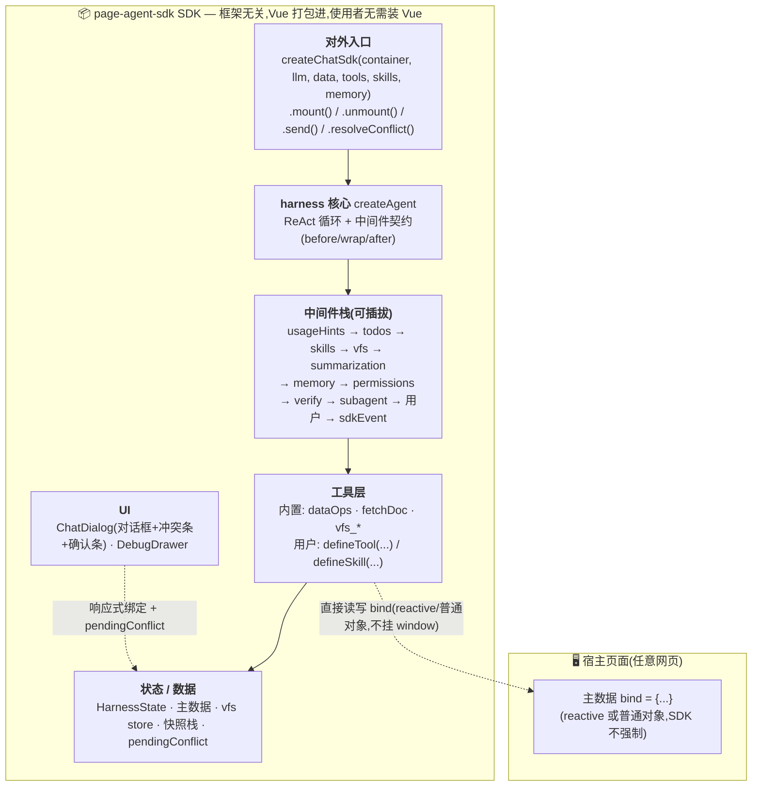

### 分层职责

| 层 | 职责 | 关键源文件 |
|---|---|---|
| **对外入口** | 命令式 API,组装 harness + 内置工具/中间件,挂载 UI,暴露冲突解决 | `src/core/sdk/createChatSdk.ts`、`defineTool.ts` |
| **harness 核心** | ReAct 循环 + 中间件生命周期 + 格式自纠 + verify 自纠 | `src/core/harness/createAgent.ts`、`middleware.ts`、`state.ts` |
| **中间件栈** | 可插拔能力(planning/skills/工作区/压缩/记忆/权限/verify/subagent) | `src/core/harness/{todos,skills,summarization,memory,permissions,verify,subagent,usageHints}.ts` |
| **工具层** | Agent 可调用的能力(数据操作含乐观锁/抓文档/工作区/自定义) | `src/core/tools/{dataOps,fetchDoc}.ts`、`backends/vfs.ts`、`utils/offload.ts` |
| **状态/数据** | 运行态 + 主数据 + 工作区 + 快照栈 + 冲突挂起 | `HarnessState`、主数据 bind、`VfsStore`、`pendingConflict` ref |
| **UI(通用)** | 对话框 + 调试抽屉 + 冲突条 + 确认条(SDK 内) | `src/core/components/{ChatDialog,DebugDrawer}.vue` |

---

## ② 组装与挂载流程

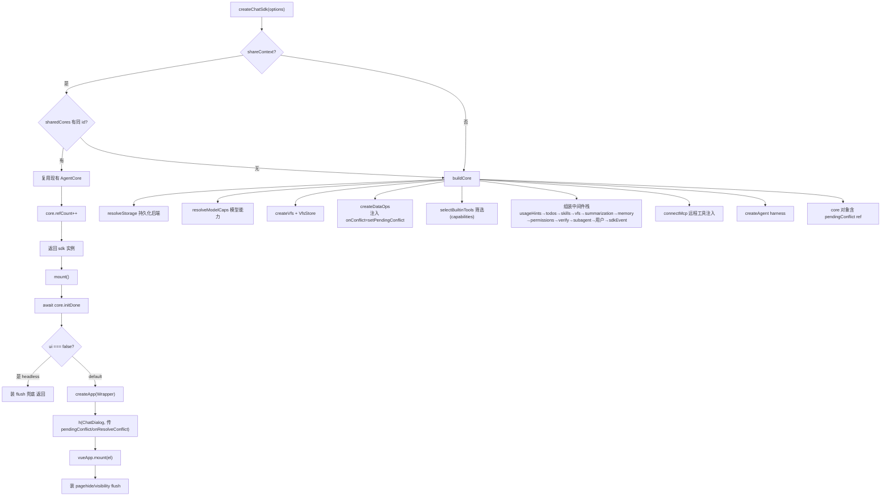

**要点:**
- `shareContext` 复用 core 时,`pendingConflict` ref 也共享——同 id 多实例是「同一 agent 的多对话框视图」,共享冲突 UI 一致
- `dataOps` 关闭(`capabilities.dataOps:false`)时不注入 `onConflict`,`pendingConflict` 永远 null,无副作用

---

## ③ ReAct 主循环(含中间件钩子 + 格式自纠 + verify 自纠)

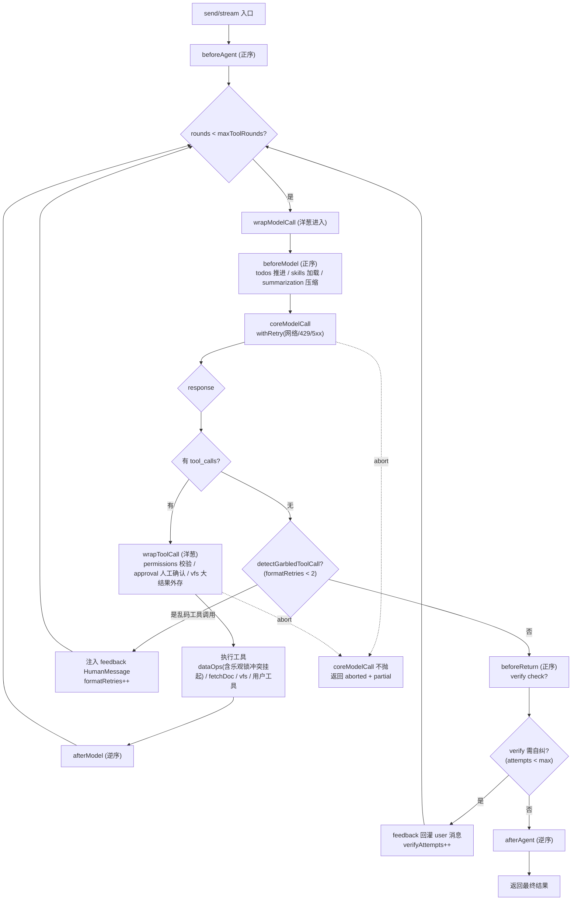

> 钩子顺序:**before 类正序、after 类逆序、wrap 类洋葱(reduceRight)**。
> `formatRetries` / `verifyAttempts` 均为 **per-run**(每次 stream/invoke 调用重置),长会话不累加。
> abort 时 `coreModelCall` 不抛、返回已生成 partial;**挂起的 approval/conflict 由 stream 包装层监听 abort 自动收口**(见 ⑤)。

---

## ④ 数据操作与乐观锁流程

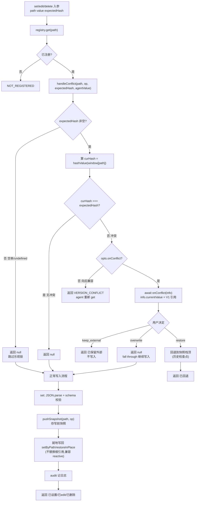

**数据存储位置:**
- **实际值** → 宿主 `window[path]`(唯一数据源,V0/V1/V2 都在这)
- **快照** → `dataOps` 闭包内 `snapshots: SnapshotEntry[]`(纯内存栈,FIFO 限长 20)
- **hash** → 实时计算 `djb2(safeStringify(value))`,不存储,只在 `get_data`/`read` 返回末尾附 `hash=xxx`(整体 bind 的 hash)
- **冲突挂起信息** → `core.pendingConflict` ref(响应式内存,供 UI)+ `SdkEvent 'conflict'` 外发

**关键约定:**
- `get` 不存快照 → `restore` 只能回到「快照栈顶(历史检查点)」,无法回到 agent `get` 时的 V0
- `overwrite` 由正常流程 `pushSnapshot`(避免冲突时重复 push 浪费栈位)
- 不传 `expectedHash` → 向后兼容直接写(不校验)

---

## ⑤ 冲突人工介入(挂起 + 事件 + UI + abort 联动)

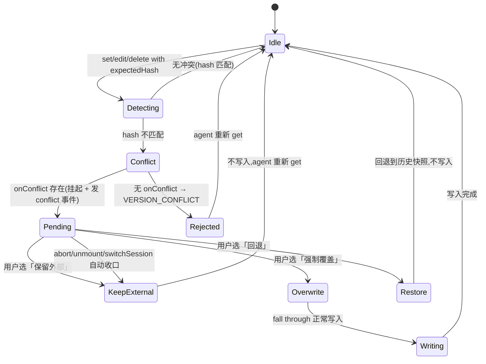

**三选项语义:**
| 选项 | 行为 | window[path] 结果 |
|------|------|-------------------|
| `keep_external` | 不写入,保留外部改后的值 | V1(外部改后) |
| `overwrite` | 强制执行 agent 写入 | V2(agent 值) |
| `restore` | 回退到快照栈顶(历史检查点) | 栈顶快照值(可能撤销外部改) |

**挂起收口(防永久挂起):**
- **abort**:用户停止生成 → `stream`/`fetchResponse` 包装层监听 `signal.abort` → 自动 `resolveConflict('keep_external')`
- **unmount**:`unmount()` 调 `resolveConflict('keep_external')`
- **switchSession**:`switchSession()` 开头调 `resolveConflict('keep_external')`

**集成方接入:**
- 内置 UI:ChatDialog 渲染冲突条(三按钮 + 值对比 diff),用户点按钮调 `sdk.resolveConflict(action)`
- headless:`watch(sdk.pendingConflict)` 或 `sdk.hook(e => e.type==='conflict')` 自建 UI,调 `sdk.resolveConflict(action)`
- 独立 `createDataOps(config, { onConflict })`:不接 ChatDialog 时自行处理冲突

---

## ⑥ 上下文压缩与持久化

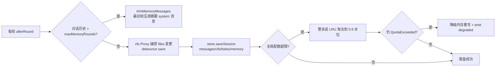

> 详细压缩策略见 [`context-management.md`](./context-management.md);持久化配额/淘汰/降级见 `CLAUDE.md`「持久化存储」小节。

---

## ⑦ 事件流(订阅入口 + 各事件触发点)

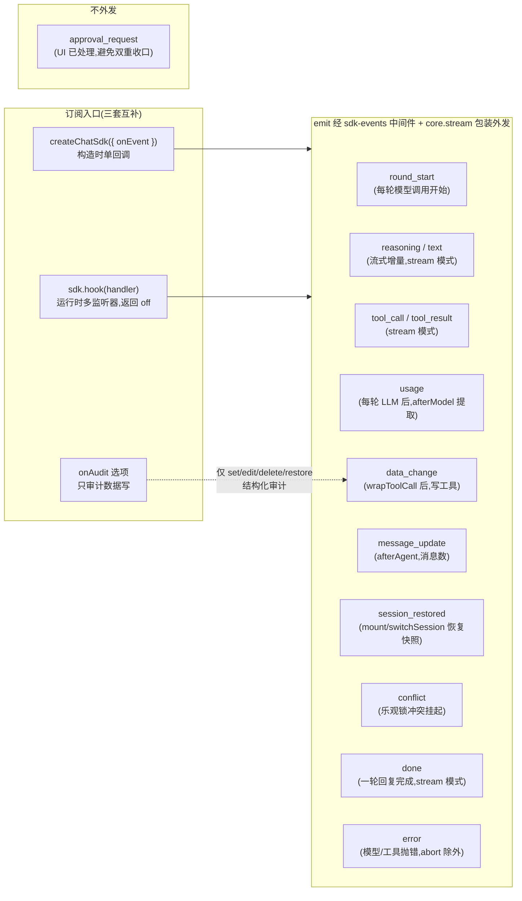

**要点:**
- `onEvent`(构造时单回调)与 `sdk.hook`(运行时多监听器、可取消)功能重叠,前者便捷、后者灵活,可并存
- `onAudit` 独立于 `debug`,无需 `debug:true`,只发数据写操作的结构化审计事件
- 流式事件(`text`/`reasoning`/`tool_call`/`tool_result`/`done`)仅 **stream 模式**触发(UI 默认 stream;`sdk.send` 走 invoke 无流式,但 `data_change`/`message_update`/`error` 仍发)
- `sdk.usage` 累计 token 用量,单轮明细经 `usage` 事件外发

---

## ⑧ 会话恢复流程(mount 自动恢复 / switchSession 切换)

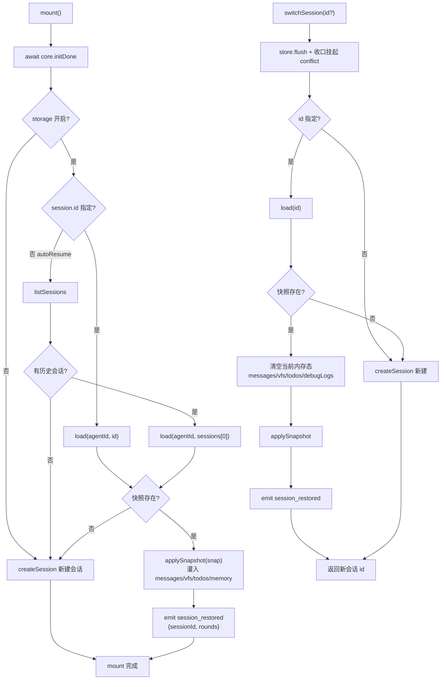

**要点:**
- `applySnapshot` 灌入 messages/vfs/todos/memory;**不灌 `bind`**(bind 是集成方外部业务对象,由集成方管理)
- 恢复会话后发 `session_restored` 事件(`rounds` = 恢复的消息数),集成方可据此提示「已恢复 N 轮对话」
- `switchSession` 开头自动收口挂起的 conflict(按「保留外部」),防切会话后旧 conflict Promise 永挂

---

## ⑨ 子 agent 编排(spawn 委派 + 进度转发)

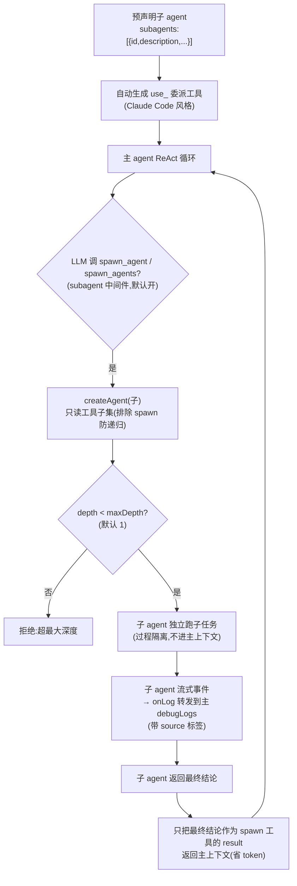

**要点:**
- 子 agent 只读工具子集,排除 `spawn_agent`/`spawn_agents` 防递归
- 子 agent 过程不进主上下文,只回最终结论 → 省 token
- `maxDepth`(默认 1)递归物理切断;预声明子 agent 自动生成 `use_<id>` 委派工具
- 子 agent 日志经 `onLog` 转发到主 debugLogs(带 `source` 标签,调试面板可区分)
- **skill 全文缓存**:`load_skill` 首次 `getContent` 后缓存到 middleware 内存(contentCache),跨轮跨会话复用,避免重复 IO + 重复 offload;`beforeAgent` 清 `loaded` Set(允许跨轮重新 load,但用缓存内容);offload 内容寻址去重(相同内容复用同一 vfs 文件)
- **运行时动态 skill**:`skills` 中间件挂 `SkillsController`(不可枚举),`createChatSdk` 暴露 `sdk.setSkills(skills)`(替换整个列表,同名覆盖,清 contentCache + loaded,下轮 `augmentPrompt` 重渲染索引)/ `sdk.invalidateSkillCache(name?)`(清指定/全部缓存);`inspect().skills` 读 `controller.get()` 反映运行时替换。用于懒加载组件等运行时增删 skill 场景

---

## ⑩ MCP 远程工具注入

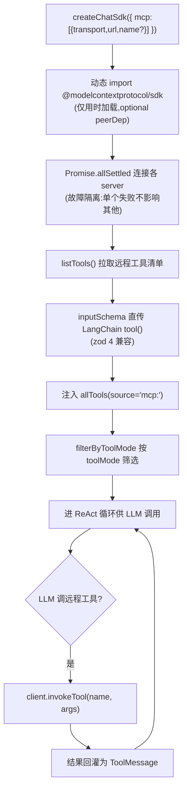

**要点:**
- MCP 仅支持远程 transport(http/sse/websocket),浏览器无本地 stdio
- `Promise.allSettled` 故障隔离:单个 server 连接失败不影响其他
- `inspect().mcp.servers` 与每个工具 `source` 字段反映 MCP 配置
- dev 预构建坑:`vite.config.ts` 的 `optimizeDeps.include` 已预声明 SDK 子路径,否则冷启动首次注入失败

---

## ⑪ Approval 人工确认(human-in-the-loop)

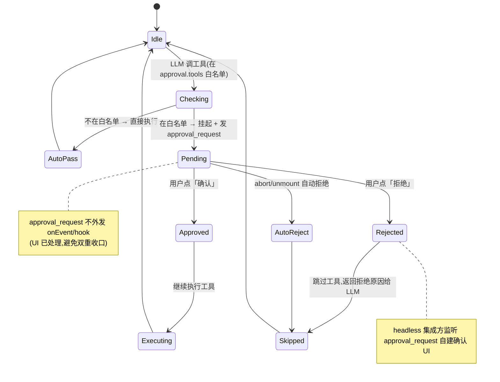

**要点:**
- `approval:{ tools?, confirm?, ... }` 默认关闭,传 `approval` 即启用
- 被动白名单:`approval.tools` 列出需确认的工具名;主动工具:`request_human_confirmation` 工具供 LLM 主动请求确认
- `approval_request` 不外发 `onEvent`/`hook`(内置 UI 已处理,避免集成方误调 `resolve` 双重收口);headless 集成方监听 `approval_request` 自建确认框
- abort/unmount 自动拒绝,防永久挂起

---

## 关键特性

| 维度 | 设计 |
|---|---|
| **Agent 核心** | 自研 ReAct + 中间件契约(对齐 Deep Agents,零 LangGraph 依赖)+ 格式自纠 + verify 自纠 |
| **数据操作** | 单主对象 `data:{schema,bind}`;schema 校验 + 增量编辑(jsonPath)+ 按路径读 + 快照回退 + **乐观锁(expectedHash)+ 冲突人工介入** + **schema 形状自动白名单**(ZodObject 顶层声明字段隐藏未声明项)+ 高层 `read`(fields/depth 裁剪)+ `write`(批量 patches 原子)+ 大结果外存 vfs |
| **能力扩展** | 中间件(todos/skills/vfs/summarization/memory/permissions/verify/subagent/usageHints)+ 工具(`defineTool`)+ 技能(`defineSkill` 渐进披露) |
| **记忆** | 纯内存会话级;summarization 复用 `useContextManager`(滑动窗口 + 摘要 + 关键词召回);`maxMemoryRounds` 防长会话 OOM |
| **持久化** | 多后端(IndexedDB/WebStorage/Memory)+ 多 agent 隔离 + 全局配额 LRU 淘汰 + 降级内存 |
| **响应式** | `bind = reactive() 或普通对象`(工具直接读写 bind,不挂 window;普通对象经 `onEvent('data_change')` 或 `:key` 重渲染);set 子属性不替换引用 → 页面实时更新 |
| **鲁棒性** | 模型调用重试(网络/429/5xx)+ 停止生成(abort 保留 partial)+ 出错重试 + 冲突挂起自动收口 |
| **交付** | 框架无关 SDK(vue 打包进)+ 命令式 `mount` + headless(`ui:false`)+ 纯 HTML 集成(`demo/plain.html`) |

---

## 相关文档
- 使用手册:[`./usage-guide.md`](./usage-guide.md)(安装/配置项/能力详解/FAQ)
- 上下文压缩策略:[`./context-management.md`](./context-management.md)
- 项目指引 / 约定与坑:[`../CLAUDE.md`](../CLAUDE.md)
- 框架无关集成示例:[`../demo/plain.html`](../demo/plain.html)
