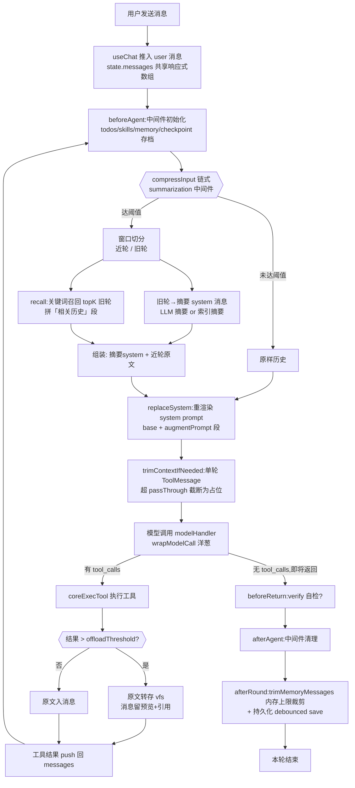
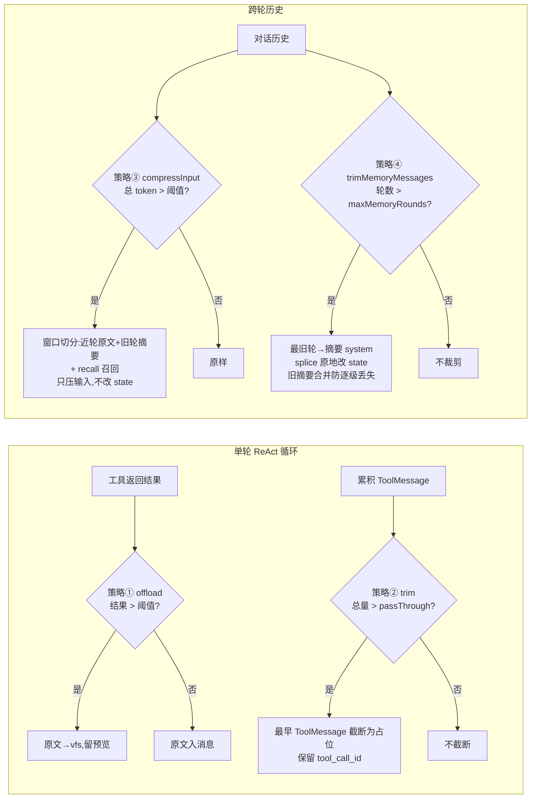
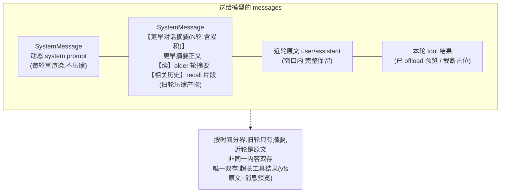

# 上下文组成与压缩策略

> page-agent-sdk 的上下文（送给大模型的 messages）如何组装、何时压缩、压缩后长什么样。含流程图。
>
> 对齐 Deep Agents 的 context 管理思路，但面向浏览器场景做了自适应与零成本兜底。

---

## 一、上下文组成

每轮 agent 行动前，送给模型的 messages 由 **3 部分**拼接而成：

```
[ SystemMessage(动态组装) , ...对话历史(user/assistant/tool) ]
        ↑ 1) system prompt                ↑ 2+3) 历史与工具结果
```

### 1. System Prompt（每轮动态组装，从不压缩）

`buildSystemPrompt()` 每轮重新拼接，**不进对话历史、不被压缩**：

```
base systemPrompt（集成方注入的身份/规则）
  + augmentPrompt 段（按中间件装载序，正序拼接）：
      usageHints  能力用法提示（write_todos/edit 增量/restore/query/search/eval/spawn/humanConfirm）
      todos       当前任务清单渲染
      skills      已声明技能索引
      memory      AGENTS.md 持久指令
      ...用户自定义中间件
```

- base systemPrompt 缺省 `你是一个智能助手。`
- 各段可选（能力关则不注入）；全部关则只剩 base
- **每轮重渲染** → todos 推进、memory 更新都能即时反映，且无累积损失

### 2. 对话历史（user / assistant，可被压缩）

`state.messages` 响应式数组，与 UI 共享同一引用。每条 assistant 可含 `reasoning`（思考）与 `steps`（工具步骤）。

- 由 useChat / `core.send` 推入
- 是压缩的主要对象（见下文）

### 3. 工具结果（tool 角色，单轮 ReAct 循环内累积）

- 仅在**单次 chat() 的 ReAct 循环内**累积（ToolMessage），跨轮不保留
- 超长时走「大结果外存」（见策略 4）

> 注：跨轮 `state.messages` 只含 user/assistant 文本 + trim 产生的摘要 system；工具结果不跨轮。所以跨轮压缩聚焦于「窗口 + 摘要 + 召回」。

---

## 二、压缩策略（4 层，各管一段）

| 层 | 触发时机 | 作用域 | 是否改 state.messages | 有损 | 成本 |
|---|---|---|---|---|---|
| ① 大结果外存 offload | 工具返回时 | 单条工具结果 | 否（只改该条消息内容） | 否（原文进 vfs） | 零（无 LLM） |
| ② 逐轮截断 trimContextIfNeeded | 每轮 beforeModel | 单轮内 ToolMessage | 否（只改输入副本） | 是（截断） | 零 |
| ③ 输入压缩 summarization(compressInput) | 每轮 beforeModel | 跨轮历史 | **否**（只压输入，state 保留原文） | 是（旧轮→摘要） | LLM 摘要或零（索引摘要） |
| ④ 内存上限裁剪 trimMemoryMessages | 每轮 afterRound | 跨轮历史 | **是**（splice 原地改） | 是（旧轮→摘要） | 零（索引摘要） |

### 策略 ① 大结果外存（offload）

- 工具结果 > `offloadThreshold`（自适应：`max(2000, min(20000, contextWindow×3.5%))`，1M 上下文→20000 字符）时，原文转存 **vfs**，消息里只留**预览 + vfs 引用**
- 原文可经 `vfs_read` / `vfs_grep` 取回 → **不丢信息**，只省 token
- vfs 不可用退化为截断

### 策略 ② 逐轮截断（trimContextIfNeeded）

- 单轮 ReAct 循环内累积的 ToolMessage 总量超 `offloadPassThrough`（`min(200000, max(threshold, contextWindow×70%))`）时，从最早 ToolMessage 起截断为「首 N 字 + 原长度提示」占位
- 保留 `tool_call_id`（结构完整，模型仍能对应）
- `keep` 自适应：小阈值保留首 100、大阈值保留首 400（clamp 100–400）
- **只压输入副本，不改 state**

### 策略 ③ 输入压缩（summarization / compressInput）

- 每轮 beforeModel，summarization 中间件对跨轮历史做窗口切分：
  - **近轮**（窗口内）→ **原文**完整保留
  - **旧轮**（窗口外）→ 压成**一条** system 摘要消息
- 窗口切分：token 驱动优先（`summaryThresholdRatio` 触发，`windowRatio` 定窗口预算），否则按轮数（`windowRounds`）
- 摘要方式：`enableLLMSummary`（默认开）→ LLM 摘要（失败/超时回退索引摘要）；否则零成本「索引摘要」（每轮 userQuery 60 字 + assistantPreview 80 字）
- **召回 recall**：`enableRecall` 时从旧轮按当前问题关键词检索 topK（`recallTopK`），把命中轮的简短片段拼进摘要消息的「相关历史」段
- **关键：只压输入，不改 state.messages** → 每轮从完整原文重新摘要，无累积损失叠加

### 策略 ④ 内存上限裁剪（trimMemoryMessages）

- 每轮 afterRound，`maxMemoryRounds`（默认 50）超限时，把最旧轮压缩成一条 `【更早对话摘要】` system 消息，`splice` 原地替换（保持响应式引用）
- `storage:false` 也生效（纯内存 OOM 兜底）；`0` 关闭
- **关键修复：旧摘要合并**——头部已有的上一轮摘要 system，`groupRounds` 会跳过（头部 system 不进轮）；若不并入会被 splice 静默丢弃 → 更早摘要逐级丢失。`trimMemoryMessagesImpl` 提取头部旧摘要正文，去 header 后并入新摘要作【续】段，保证累积历史不丢

---

## 三、压缩后的上下文长这样

压缩触发后，送给模型的 messages 结构（按时间分界，非同一内容双存）：

```
[
  SystemMessage(动态 system prompt),        ← 每轮重渲染，不压缩
  SystemMessage(【更早对话摘要(N轮,含累积)】  ← 旧轮压缩(策略③或④产物)
      ...更早摘要正文...
      【续】
      - 第k轮:query → preview
      ...older 轮摘要...
      【与当前问题可能相关的早期对话】        ← recall 召回片段(策略③)
      - 第m轮:... ),
  ...近轮原文(user/assistant)...             ← 窗口内原文保留
  ...本轮 ReAct 的 tool 结果(已 offload/截断)  ← 策略①②
]
```

**唯一「原文另存」**：超长工具结果 → vfs 存原文 + 消息留预览（策略①，省 token 又不丢）。其余历史原文压缩后即丢，仅保留摘要。

---

## 四、流程图

### 图 1：每轮上下文构建与压缩总流程



### 图 2：压缩策略决策（4 层各管一段）



### 图 3：压缩后消息结构（时间分界）



---

## 五、配置

### 预设档位（`contextPreset`，默认 `auto`）

| 档位 | summaryThresholdRatio | windowRatio | recallTopK | enableRecall | enableLLMSummary |
|---|---|---|---|---|---|
| `auto`（默认） | 0.5 | 0.4 | 3 | true | true |
| `conservative` | 0.7 | 0.5 | 2 | true | false |
| `aggressive` | 0.3 | 0.3 | 5 | true | true |

- `auto`：平衡，默认 LLM 摘要
- `conservative`：保守，少压缩、零成本索引摘要
- `aggressive`：激进，更早压缩、更多召回

### 细参覆盖（`contextOptions`）

在预设基础上覆盖个别字段：`contextWindow` / `windowRounds` / `summaryThresholdRounds` / `summaryThresholdRatio` / `windowRatio` / `recallTopK` / `enableRecall` / `enableLLMSummary`。`contextOptions: false` 关闭 summarization 中间件。

### 摘要专用 LLM

- `summaryLlm`：摘要专用模型（不配用主 agent llm）；缺 apiKey 自动回退零成本索引摘要并 warn
- `summaryTemperature`（默认 0.3）/ `summaryMaxTokens`（默认 1024）/ `summaryTimeoutMs`（默认 15000，超时回退索引摘要不阻塞）

### 内存/回退上限

- `maxMemoryRounds`（默认 50）：超限压缩为摘要 system；`0` 关闭
- `vfs.maxBytes`（默认 4MB）：超限 LRU 淘汰最旧文件
- `maxSnapshots`（默认 20）：windowOps per-path 快照栈
- `checkpoint.maxCheckpoints`（默认 5）：会话级回滚档

---

## 六、可观测性

- `agent.inspect().lastCompression`：最近一次跨轮压缩统计（triggered / roundsTotal / roundsSummarized / roundsRecalled / originalMessages / compressedMessages / strategy）
- DebugDrawer「Agent 信息」tab 展示压缩统计
- `agent.inspect().checkpoints`：会话级回滚档列表

---

## 七、与 Deep Agents 的差异

| 维度 | Deep Agents | page-agent-sdk |
|---|---|---|
| 跨轮压缩 | checkpointer 每步存档 | summarization 输入压缩（不改 state）+ trimMemoryMessages 内存裁剪 |
| 摘要累积 | 持久化 checkpoint 历史 | 旧摘要合并进新摘要（防逐级丢失），但仅内存 |
| 工具结果 | 进 graph state | 单轮内累积，超长 offload 到 vfs（原文不丢） |
| store | 跨 thread KV 语义记忆 | 未实现（memory 为单字符串指令） |
| 时间旅行 | 任意历史 checkpoint（持久化） | 仅内存 checkpoint（刷新丢） |

**一句话**：page-agent-sdk 上下文 = 动态 system prompt（不压缩）+ 旧轮摘要 + 近轮原文 + 本轮工具结果（超长外存 vfs）；4 层压缩自适应触发，零成本兜底，旧摘要合并防累积丢失。
